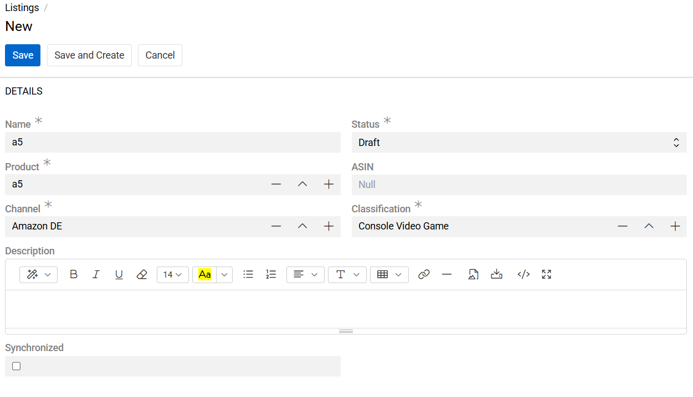
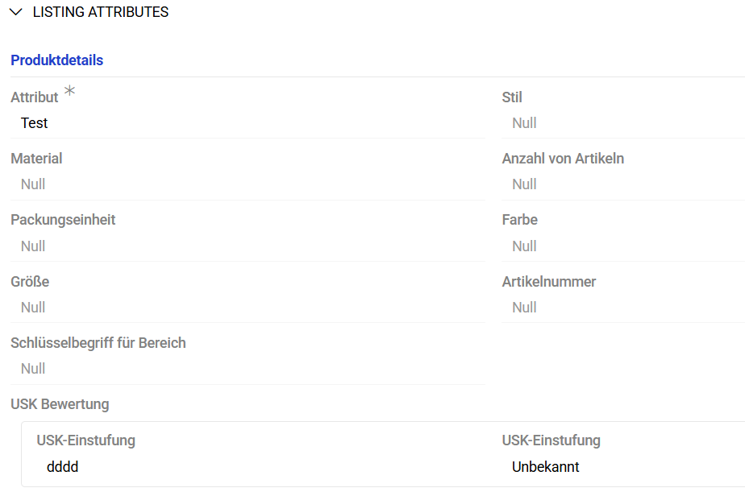

The Product Listing is designed to help teams manage and adapt product data for multiple online sales channels. It enables the creation of channel-specific product variations without modifying the original product record in the system.

A Product Listing can be exported and used in place of a product during data synchronization with external systems or e-commerce platforms.

## Overview

A Product Listing is an independent entity that maintains a reference to the corresponding Product record. It allows administrators to define how a product should be represented or configured for a particular Channel (for example, an online store, marketplace, or distribution partner).

When creating a Product Listing, the following parameters must be specified:

- [Product](../03.products/index.md) – the source product to which the listing is linked.
- [Channel](../06.channels/index.md) – the sales channel or platform where the product will be published.
- Status – defines the operational state of the listing (e.g., Active, Inactive, Draft).
- [Classification](../07.classifications/index.md) – determines the attribute set associated with the listing.

The Product Listing entity also supports several optional parameters used for more specific control over listing behavior and channel synchronization:

- ASIN – defines the Amazon Standard Identification Number (ASIN) or equivalent unique identifier used by external marketplaces. This field is typically used for listings synchronized with Amazon or similar platforms where a standard identifier is required.
- Description – allows overriding the default product description for a particular listing. This enables the use of channel-specific marketing text, formatting, or language variations without affecting the base product description.
- Synchronized – a checkbox indicating whether the listing has been successfully synchronized with the assigned channel. When selected, it signifies that the listing data is up-to-date in the external system.

{.medium}

These parameters are optional and can be configured depending on the integration or business requirements of each channel.

For each unique combination of Product, Channel, and Classification, only one Product Listing record can exist. This rule ensures data consistency and prevents duplicate configurations.

## Classification Dependency

A Classification must be created prior to the creation of a Product Listing.
When a Classification is selected, all attributes defined in that Classification are automatically assigned to the newly created Listing record.

{.large}

> Once the Product Listing is created, new attributes cannot be added to it manually. To change or expand the attribute set, the Classification must be updated first. This is standard system behavior.

## Export and Synchronization Behavior

Product Listings are included in AtroCore’s standard data export and synchronization workflows.