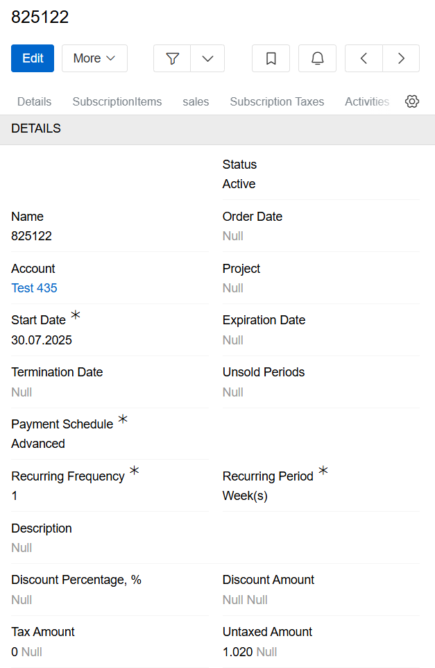
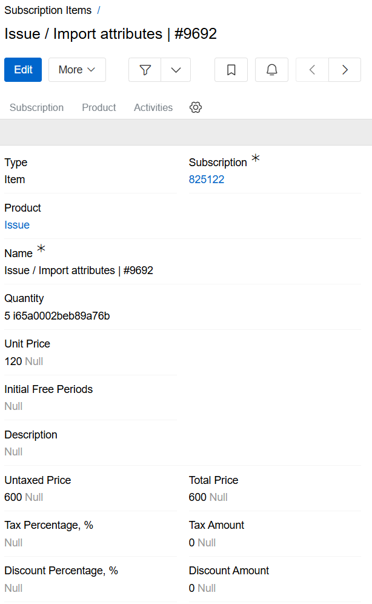
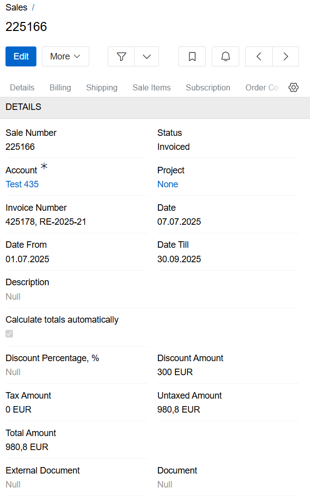
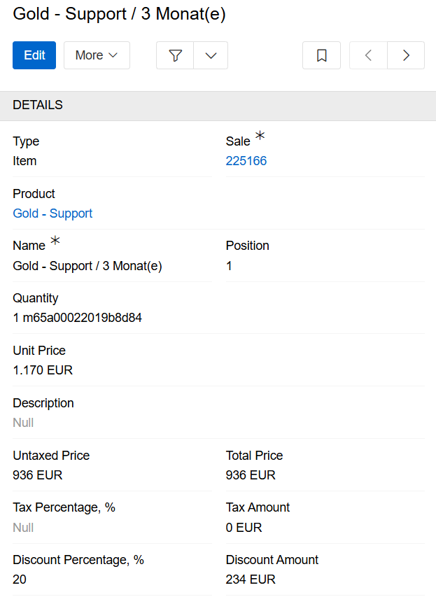
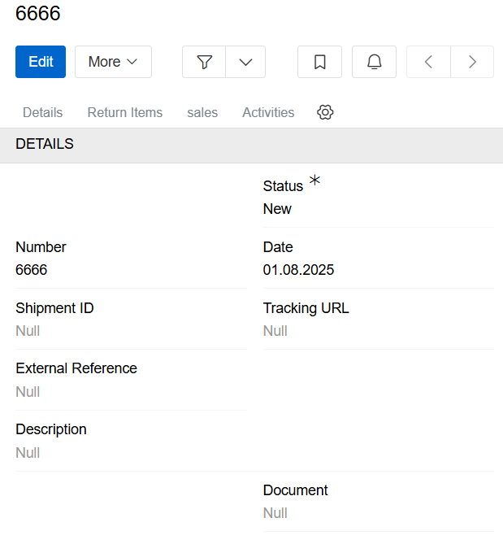
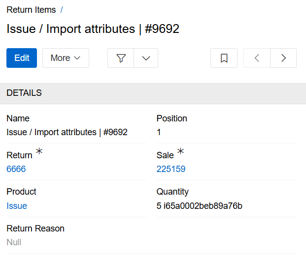
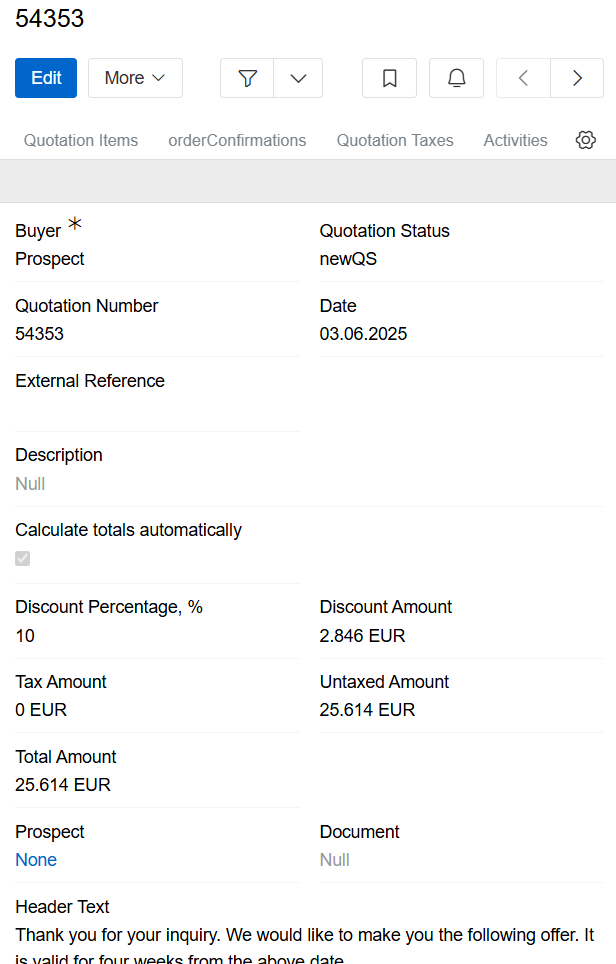

---
title: Sales
taxonomy:
    category: docs
--- 

[Sales](https://store.atrocore.com/en/sales/20183) module facilitates the management of subscriptions and sales orders, as well as the creation of sales, returns, quotations and subscriptions within the AtroCore system. It can also be used as middleware between an ERP system and an online store.

> The sales module has no built-in internal business logic. The out-of-the-box version of the sales module only stores data.

The Sales module creates new entities in the system when installed.

## Subscriptions

As a pricing model, ERP subscriptions typically involve recurring fees for access to cloud-based software, providing flexibility, lower upfront costs, and bundled updates/support.

In AtroCore, subscriptions are stored in the 'Subscriptions' entity. These consist of subscription items and subscription details. The required fields are 'Start Date', 'Payment Schedule', 'Recurring Frequency', 'Recurring Period' and 'Currency'.

{.large}

### Subscription items

Subscription items are stored separately. There are different types of subscription item. The main type is the item. This consists of a link to the subscription, as well as the price, tax, discount and quantity. Items can be grouped using other sale item types, such as sections, subtotals and groups. You can also add notes to include additional text.

{.large}

## Sales

In an ERP system, "sales" refers to the comprehensive set of processes, features, and data management tools that handle all aspects of a company's sales cycle, from initial lead generation and customer interaction to order processing, inventory management, invoicing, and post-sales support.

In AtroCore, sales are stored in the 'Sales' entity. It consists of sale items and sale details. The only required fields are 'Account' and 'Currency'.

{.large}

### Sale items

Sale items are stored as a separate entity. There are different types of sale items. The main one is the item. It consists of links to the product and sale, price, tax, discount and quantity. You can group items using other sale item types, such as sections, subtotals and groups. You can also add notes to include additional text.

{.large}

## Returns

In ERP systems, 'returns' primarily refers to the management of receiving products back from customers — a process known as 'reverse logistics' or 'return material authorisations' (RMAs).  The overall goal is to streamline the returns process, reduce costs, improve customer satisfaction, and guarantee accurate financial and inventory data within the system.

In AtroCore, returns are stored in the 'Returns' entity. It consist of return items and shipment details, and the only required field is status.

{.medium}

### Return items

Return items are stored as separate entity. It consists of links to the product, return and sale, quantity and return reason.

{.medium}

## Quotations

In an ERP system, a quotation is a document created in the sales module offering products or services to a potential customer at a specific price and on certain terms for a defined period. 

In AtroCore, quotations are stored in the 'Quotations' entity. To improve their appearance, we recommend using the Header Text and Footer Text fields. To target a quotation at a specific customer, select the 'Buyer' field to define whether the buyer is an account or a prospect, and select the quotation currency.

{.large}

Quotation items are products, subscriptions, etc. that you want to include in a proposal. You can group them using sections, subtotals and groups. You can also add notes if you want to include additional text.