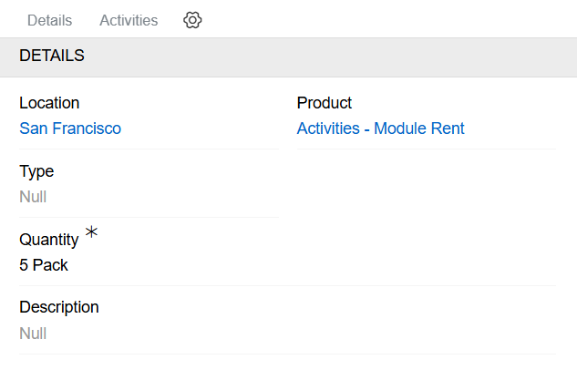
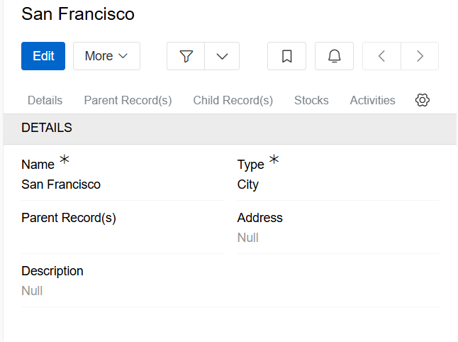

---
title: Inventory
taxonomy:
    category: docs
--- 

[Inventory](https://store.atrocore.com/en/inventory/20161) module facilitates the management of stocks within the AtroCore system. It can also be used as middleware between an ERP system and an online store.

> The inventory module has no built-in internal business logic. The out-of-the-box version of the inventories module only stores data.

The Inventory module creates new entities 'Stocks' and 'Location' in the system when installed.

## Stocks

Stocks are used to store data about managed products. In AtroCore, stocks are stored in the 'Stocks' entity. This entity consists of links to location and product type, quantity and description fields, and the only required field is status.

{.medium}

> The 'Product' and 'Type' fields cannot be changed after a record has been created.

## Location

Locations are used to store information about the location of stocks. In AtroCore, locations are stored in the 'Locations' entity. This entity consists of the following fields: 'Name', 'Type', 'Address' and 'Description'. The only required fields are 'Name' and 'Type'.

{.medium}

As location is a hierarchical entity, inheritance is possible.