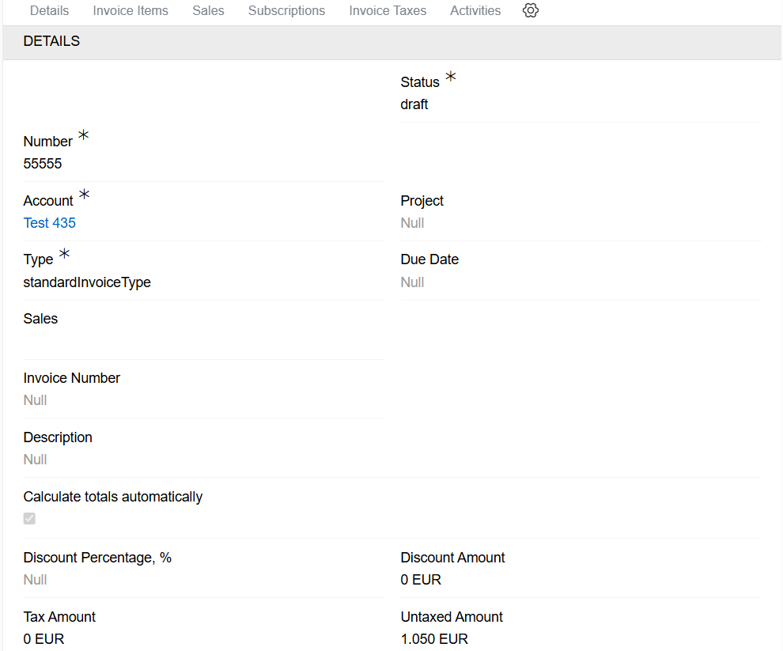
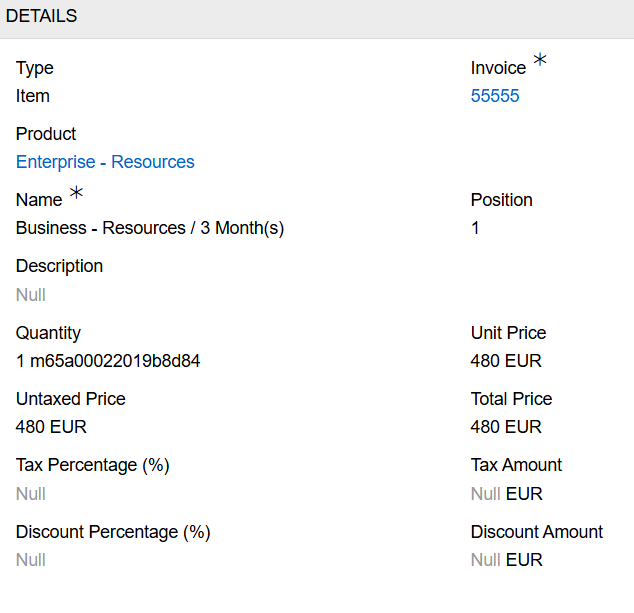
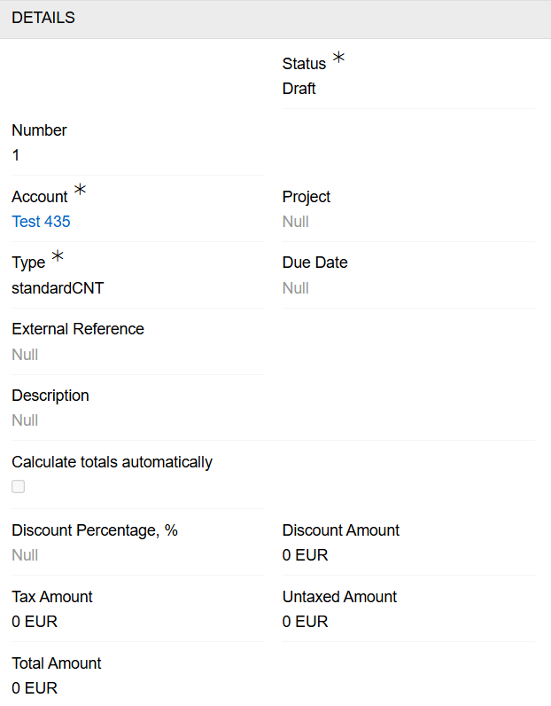
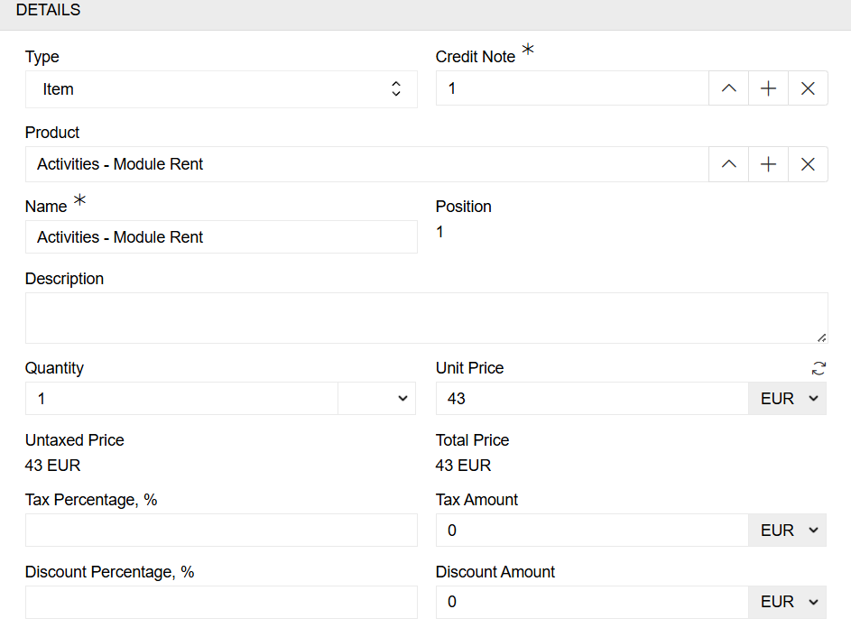

---
title: Accounting
taxonomy:
    category: docs
--- 

[Accounting](https://store.atrocore.com/en/accounting/20104) module facilitates the management of invoices and credit notes within the AtroCore system. It can also be used as middleware between an ERP system and an online store.

> The accounting module has no built-in internal business logic. The out-of-the-box version of the accounting module only stores data.

The Accounting module creates new entities 'Invoices' and 'Credit Notes' in the system when installed.

## Invoices

Invoices in an ERP system are documents that detail transactions for goods or services. They are handled through the system's accounts payable (AP) or accounts receivable (AR) modules, which are used to manage finances, track spending, automate workflows and provide real-time financial insights.

In AtroCore, invoices are stored in the 'Invoices' entity. It consists of invoice items and invoice details. The required fields are 'Number', 'Status', 'Type' and 'Currency'.

{.large}

> The 'Currency' field cannot be changed after a record has been created.

### Invoice items

Invoice items are stored separately. There are different types of invoice item. The main type is the item. This consists of a link to the invoice, as well as the price, tax, discount and quantity. Items can be grouped using other sale item types, such as sections, subtotals and groups. You can also add notes to include additional text.

{.medium}

## Credit Notes

In ERP systems, a credit note is a financial document issued by a seller to a buyer, reducing the buyer's debt or providing a refund for returned goods, overcharges, or invoice errors.

In AtroCore, credit notes are stored in the 'Credit Notes' entity. It consists of credit notes items and credit note details. The required fields are 'Account', 'Status', 'Type' and 'Currency'.

{.large}

> The 'Currency' field cannot be changed after a record has been created.

### Credit Note items

Credit Note items are stored separately. There are different types of credit note item. The main type is the item. This consists of a link to the credit note, as well as the price, tax, discount and quantity. Items can be grouped using other sale item types, such as sections, subtotals and groups. You can also add notes to include additional text.

{.medium}