The ["PDF Generator"](https://store.atrocore.com/en/pdf-generator/20166) module enables you to generate PDF files based on any data.

> Templates for PDF file generation need to be individually coded for this module to work.
> Usually these are coded directly by the AtroCore Team or by our Solution Partners.

> Templates are created based on HTML/CSS. So anything that is possible with modern HTML/CSS
> technology is achievable.

PDF documents can be generated for:

- single items, e.g., some product
- lists of items, e.g., list of products.

# User Functions

## PDF Generation for Single Items

If a template for creating PDF for a single item (e.g., Product) is available, a "Generate PDF" option will appear as a [single record action](../../02.atrocore/08.record-management/docs.md#single-record-actions) in both the detail view and list view of the respective entity.

- From [Detail View](../../02.atrocore/04.understanding-ui/docs.md#detail-view). The PDF generation option appears in the actions menu on the detail page:

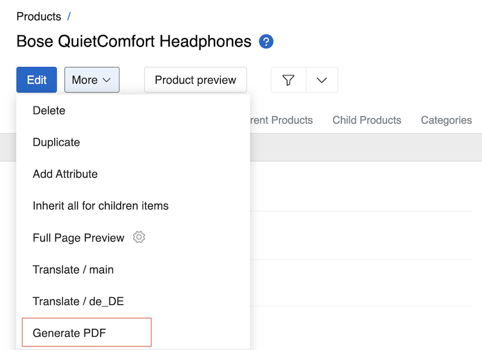{.medium}

- From [List View](../../02.atrocore/04.understanding-ui/docs.md#list-view). The same option is also available from the list view through the record actions menu:

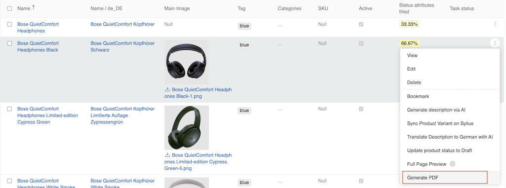{.large}

## PDF Generation Configuration

Click on "Generate PDF" from either view to open a modal window with configuration options:

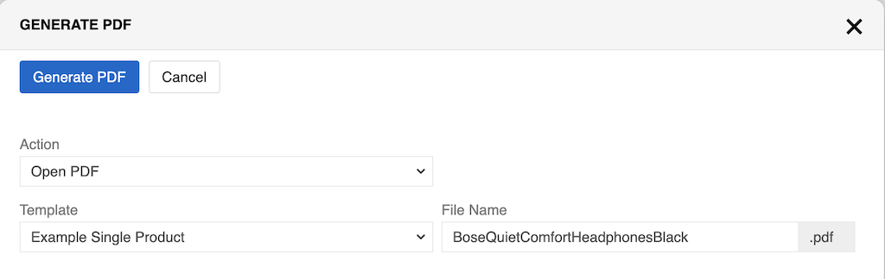{.large}

Options:

- **Action** – choose how to handle the generated PDF:
  - "Open PDF" – will open in new tab
  - "Download PDF" - will download (without opening new tab)
- **Template** – select which PDF template to use for generation
- **File Name** – define the name for the generated PDF file (the .pdf extension is automatically added)

To save PDF as a File, you need to:

1. Select "Download PDF" as the **Action**
2. Set the **Link as** checkbox to enable saving as an asset
3. Choose where to save the PDF in the **Save in** dropdown (default is "Files")
4. Folder field sets the folder for the generated PDF file
! It is recommended to create a separate folder for each generated PDF file to keep files organized and easier to manage
5. Optionally enable **Replace existing file** to overwrite existing files with the same name. This option is only available if the **Link as** checkbox is selected. While replacing an existing file, users can also change the **File Name**

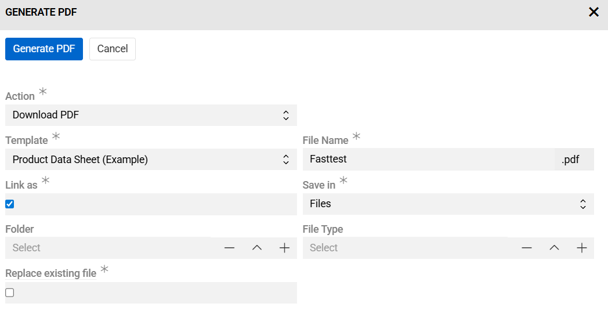{.large}

> Saving PDF as a File speeds up generating new PDFs for this item because new PDFs will be created from
> a File.

Generated PDF looks exactly as defined in your template:

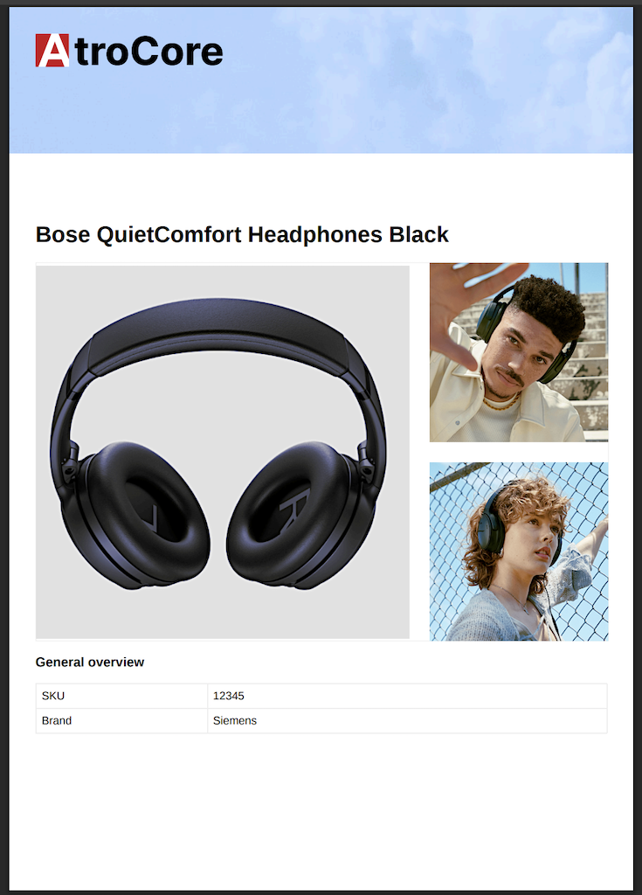{.small}


# Administrator Functions

## System Requirements

> For PDF generation, Chrome is required on your server.

You can use the following combination of commands to install Chrome browser on your Unix-based machine:

```bash
wget https://dl.google.com/linux/direct/google-chrome-stable_current_amd64.deb

sudo dpkg -i google-chrome-stable_current_amd64.deb
```

To use templates with `LibreOffice (ODT)` format, you have to install LibreOffice on your server.
On Ubuntu server, you can use the following command:

```bash
sudo apt-get install libreoffice
```

## PDF Templates

> PDF Templates are typically created by the AtroCore Team or Solution Partners. If you need custom ones, please contact your system administrator or AtroCore support.

The `PDF template` entity is used to define your own templates. You can find them in `Administration > PDF Templates`. Here you can view, edit, and create your own. If you need additionally
generated header and footer, `Page number markup in the header` and `Page number markup in the footer` are available. They are configured the same as
the `Template` field. So, if you need, for example, the number of pages, you can use pageNumber in the footer.

PDF templates markup fields use the [TWIG](../../11.developer-guide/80.twig-tutorial/) template engine.

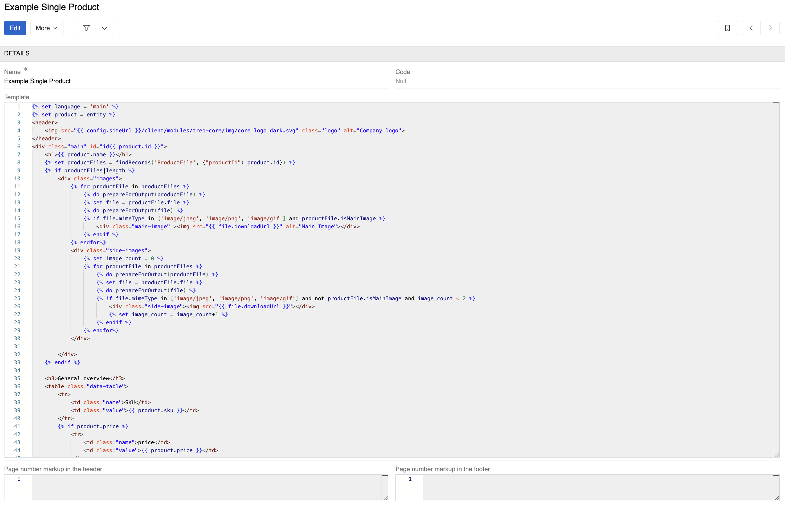{.large}

Each template specifies an input language in its syntax. To support multiple languages for the same entity, you need a separate template for each language.

You can also use a single template for multiple entities, provided they all share the same set of fields used in the template syntax.

## PDF Feeds

> PDF Feeds are typically created by the AtroCore Team or Solution Partners. If you need custom ones, please contact your system administrator or AtroCore support.

PDF feeds are managed through `Administration > PDF Feeds`. Here you can set up your PDF file generation. There are 3 types: HTML Template, ODT Template and Aggregation.

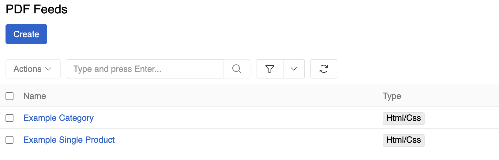{.medium}

Select an `Entity` type for a feed.

`Chrome is installed` and `Ghostscript is installed` check if Chrome and Ghostscript are installed on the server. Chrome
is required for PDFs to be generated and Ghostscript is required for `Ghostscript parameters` to function.

`Disable for direct selection` is used to hide the PDF feed from the UI view. Use this option for system feeds.

`Ghostscript parameters` allow you to modify a file created by the generator. For instance, the following parameters will convert the generated PDF to black and white:

```bash
-sColorConversionStrategy=Gray -dProcessColorModel=/DeviceGray -dCompatibilityLevel=1.4
```

This helps minimize server space usage by reducing color information in the PDF.

If your template is too big and you are afraid of timeouts, use `Use queue manager` - now PDF will be created anyway (but
it will be in [Job manager](../../02.atrocore/05.toolbar/03.job-manager/)).

For conventional naming schemas, use `File Name Template`.

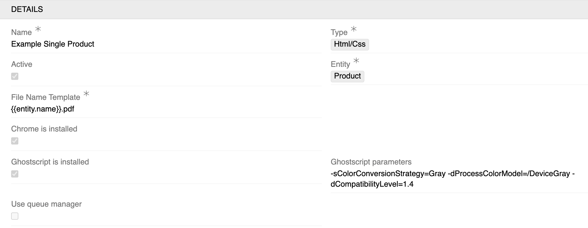{.medium}

`Folder` field sets the folder for the generated PDF file.

! It is recommended to create a separate folder for each generated PDF feed to keep files organized and easier to manage

You can configure the [filter](../../02.atrocore/11.search-and-filtering/) to specify for which entity records the PDF file generation will be available.

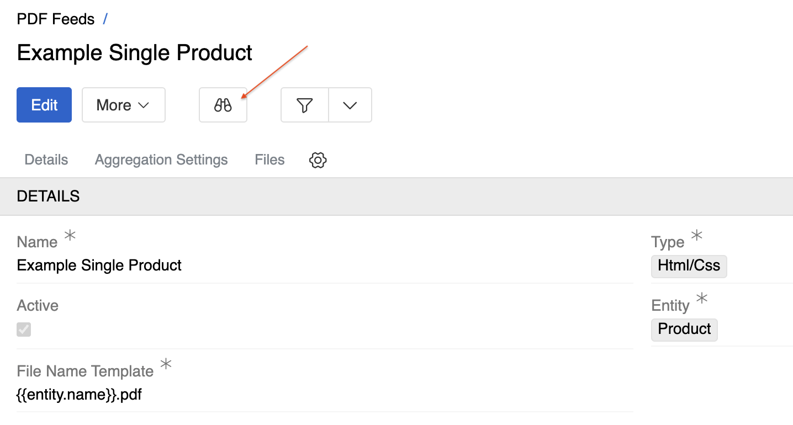{.medium}

Since you can configure automatic PDF generation via [Scheduled Jobs](../../02.atrocore/03.administration/05.system-jobs/01.scheduled-jobs/docs.md#automatic-pdf-generation), it is possible to set separate filters for manual and automatic generation.
To do this, you need to activate the `Different filter for manual generation` option in the corresponding PDF feed. As a result, there will be two separate buttons on the feed page for configuring the filtering of available entity records.

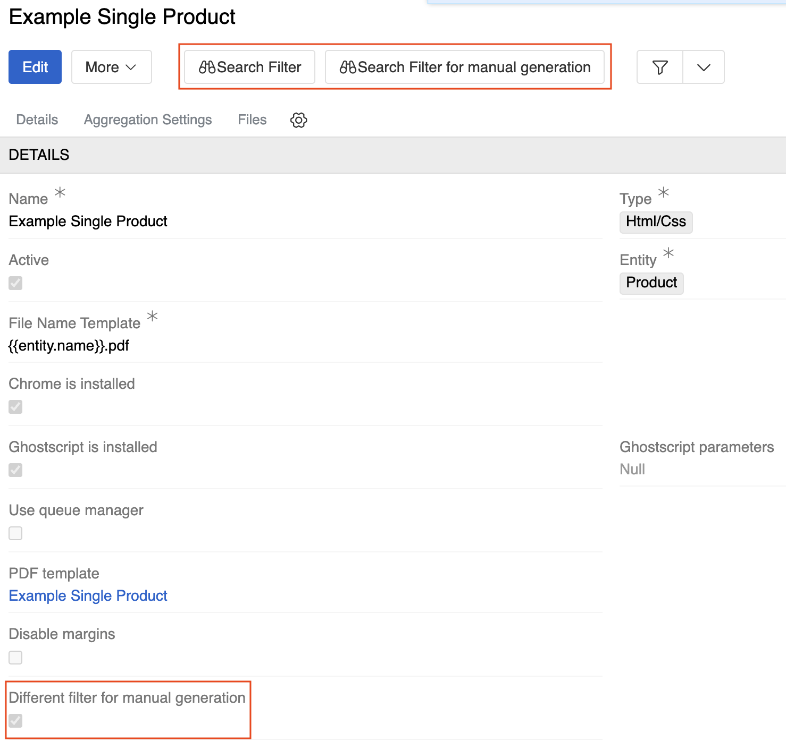{.medium}

In addition to the standard action for calling up the modal window for generating PDF files, it is also possible to define your own [Action](../../02.atrocore/03.administration/06.actions/docs.md#generate-pdf).

> If you use such action in the workflow, keep in mind that the Search filter for manual generation from the corresponding PDF feed will be used if it is set.

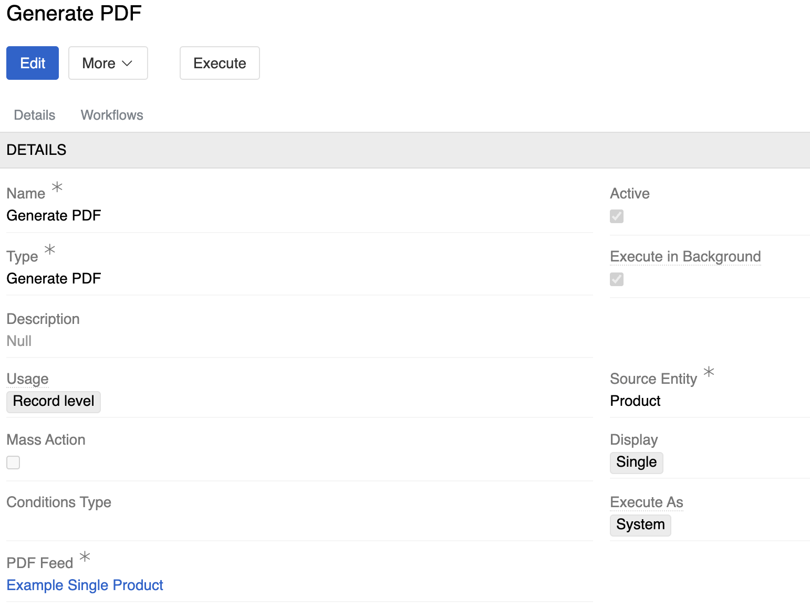{.medium}

If the PDF Feed is executed for multiple records (for example, via an [action](../../02.atrocore/03.administration/06.actions/docs.md#generate-pdf) or a [scheduled job](../../02.atrocore/03.administration/05.system-jobs/01.scheduled-jobs/docs.md#automatic-pdf-generation)), it can be created using multiple jobs in parallel. By default, one job can generate PDFs for a hundred records. This can be changed by editing the `entitiesPdfPerJob` parameter in the configuration file.

### HTML/CSS TYPE

Standard feed type for generating PDF files. It requires a [PDF template](#pdf-templates) with valid markup. There is a corresponding field in the feed settings for this purpose.
`Disable margins` field sets zero values for page indents. `Replace existing file` determines whether a new file is created during generation if checkbox is not selected, or whether the contents of an existing file for this entity record are replaced if it exists.
The last one parameter and the `Folder` are default settings and can be overridden in the PDF generation modal window or in the corresponding Scheduled Job.

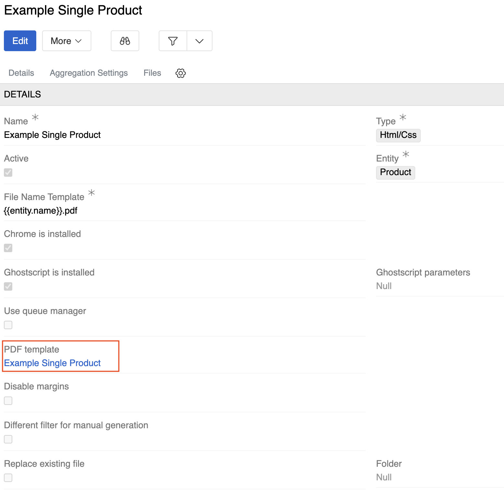{.medium}

### LIBRE OFFICE (ODT) TYPE

`Template File` is the ODT type file, `Variables` field is a JSON object that contains keys and values. Occurrences of `{key}` will be replaced by the corresponding value in your template file. You
can use TWIG syntax to build that object.

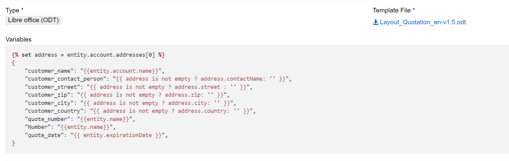{.large}

### AGGREGATION TYPE

This is a configurable feed type that allows you to flexibly customize the content of a PDF file, for example, combine multiple feeds, add static PDF files
to the beginning/end, or create a table of contents.

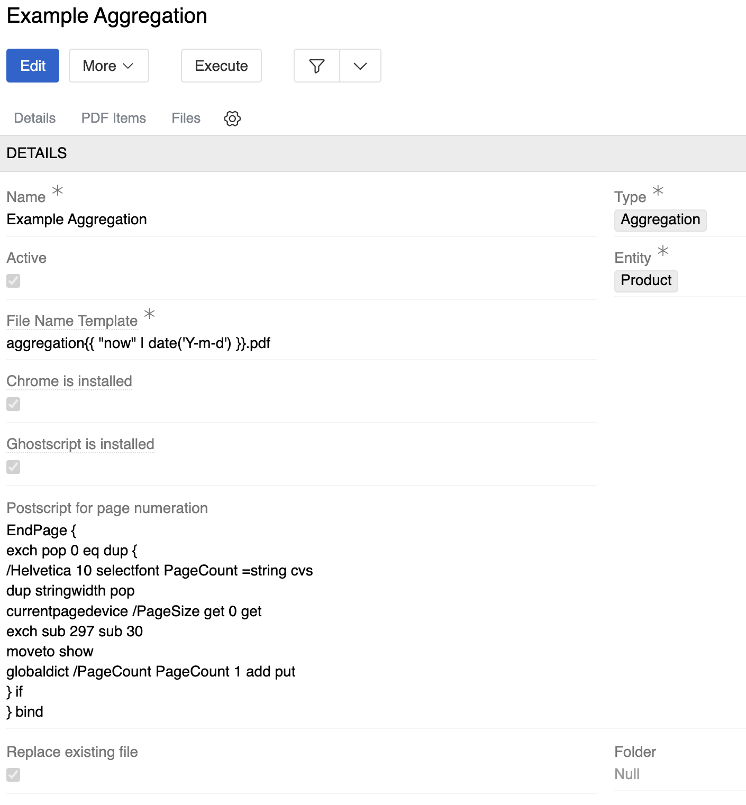{.medium}

The `Postscript for page numeration` field allows you to customize the appearance of page numbering, such as its position on the page, font, size and color.
When creating a new instance of aggregation, the default settings for numeration are used.

```bash
EndPage {
  exch pop 0 eq dup {
    /Helvetica 10 selectfont PageCount =string cvs
    dup stringwidth pop
    currentpagedevice /PageSize get 0 get
    exch sub 297 sub 30
    moveto show
    globaldict /PageCount PageCount 1 add put
  } if
} bind
```

In the PDF Items panel, you can configure in detail how data should be placed in your aggregation PDF.
There are three types of items:

- **Static PDF** – any PDF saved as a record in the File entity
- **TOC** – represents the table of contents of the generated PDF file directly. Requires the user to specify a PDF template with valid markup.
- **PDF Feed** – is responsible for generating content, which will be used to create the table of contents

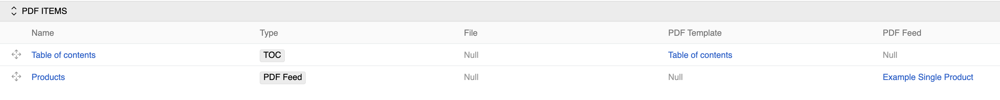{.large}

There are features that allow you to configure the order of aggregation items in the generated PDF and also group them by specific fields.
In the settings of the feed that was selected as the configuration aggregation item, there is a corresponding `Aggregation Settings` panel.

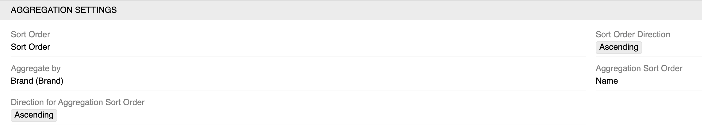{.large}

`Sort Order` specifies the field by which records will be sorted. `Aggregate by` is responsible for grouping records, for example, if you need to group products in an aggregation by brand.
In `Aggregation Sort Order`, you select the field by which the aggregated groups will be sorted. `Sort Order Direction` and `Direction for Aggregation Sort Order` determine the order in which records are sorted within groups and the order in which the groups themselves are sorted.

The templates used as content have additional data that is necessary for further file generation.
Access to data is provided through the `entities` object, which directly contains the entity object by which grouping is performed — the `group` key and the `list` key — a list of entities grouped according to the settings.

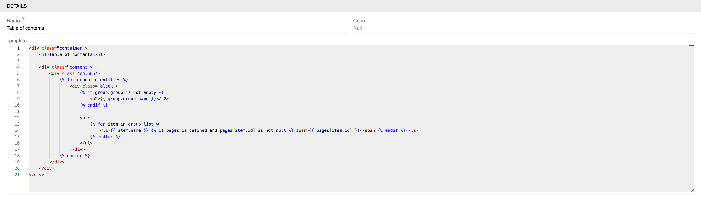{.large}
