 ---
title: EasyCatalog Adapter
taxonomy:
    category: docs
---
 
["EasyCatalog Adapter"](https://store.atrocore.com/en/indesign-pim-adapter-for-easycatalog/20157) is a Lua-based adapter that connects AtroPIM with Adobe InDesign via the EasyCatalog plug-in. It enables [AtroPIM](../../06.pim/02.what-is-atropim/docs.md) to be used as a direct data source for EasyCatalog by transferring data through enterprise data providers.

By automating the data exchange between AtroPIM and InDesign, the adapter significantly simplifies the catalog creation process, reduces manual effort, and improves overall data accuracy.

> To use this adapter [Export](../../03.data-exchange/02.export-feeds/docs.md) and [Import](../../03.data-exchange/01.import-feeds/docs.md) PIM modules are required.

With this adapter, product data from AtroPIM is automatically integrated into InDesign and becomes immediately available in EasyCatalog. The data can be used for tables, charts, and other structured layouts, allowing product catalogs and other print materials to be created quickly, consistently, and with minimal risk of errors.

> After purchasing the adapter, you will receive a Lua script file via email. The script is required for integration. The script must be stored on the machine where Adobe InDesign is installed.

## Install InDesign

Download the setup from [this site](https://helpx.adobe.com/indesign/get-started.html).

> You need to have an Adobe account to launch InDesign

## Install EasyCatalog Plugin For InDesign

EasyCatalog connects directly to the data you already use like PIM systems and more. Bring everything into InDesign with ease and keep your documents perfectly in sync with your source information.

Download Setup for you Indesign version on [this page](https://www.65bit.com/download/reg/).
After installation, launch InDesign, you will have to put a license key, and you will have the screen below.

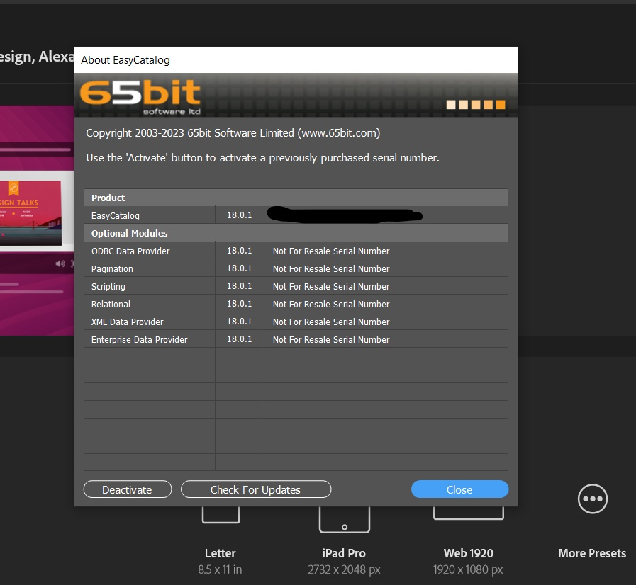{.large}

## Install Adapter in InDesign

In the File menu, go to `New / EasyCatalog Panel / Manage Enterprise Data Providers`.

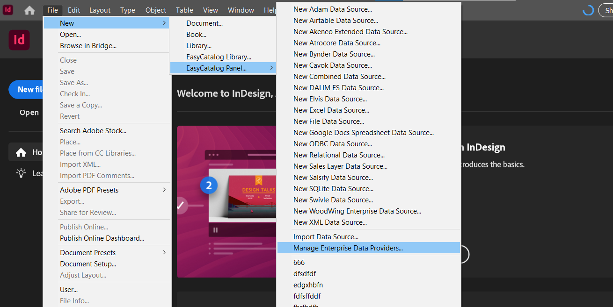{.large}

Click on `Import` button and select the script atrocore.lua on your local machine.

After that the adapter will be installed.

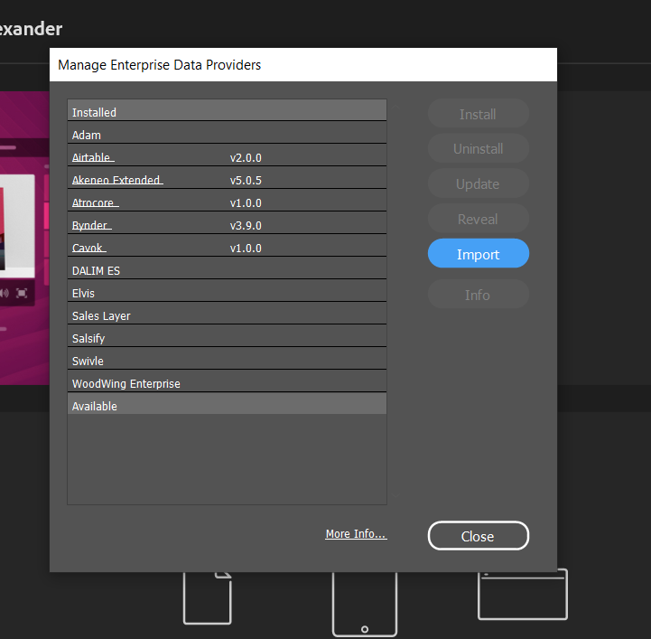{.large}

## Fetching data from PIM

To fetch the data from PIM, the adapter will need the code of an active [Export feed](../../03.data-exchange/02.export-feeds/docs.md#export-feed-creation).
You can set any value in the field `Code` in the Export feed detail page (this value must be unique in the system).
You will have to set this value in the configuration of a new EasyCatalog data source.

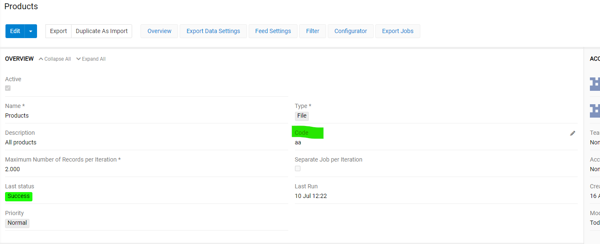{.large}

You have to use the configurator to chose what data the PIM will send to EasyCatalog.
The feed must contain a column named `ID` that contains the id of the record.

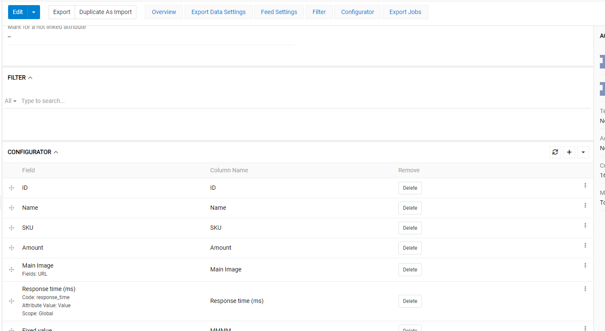{.large}

## Updating data from EasyCatalog

To update modified data in easy catalog datasource to PIM database, you need to configure an [Import feed](../../03.data-exchange/01.import-feeds/docs.md#import-feed-creation).
This feed must be active and have a code (this value must be unique in the system).
You will have to set this value in the configuration of a new easy catalog data source.

> You can create an Import feed directly from an Export feed by using the functionality [`Duplicate as Import Feed`](../../03.data-exchange/01.import-feeds/docs.md#import-feed-actions)

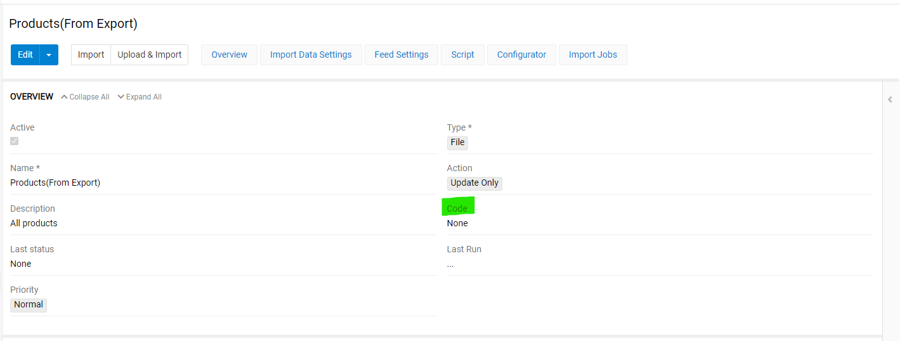{.large}

The feed must contain a column named `ID` as the entity identifier.

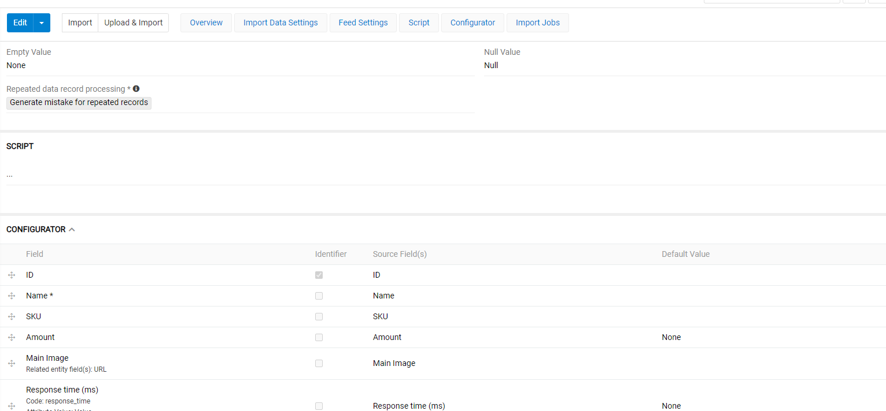{.large}

## Configure a new Data Source on EasyCatalog

To create a new datasource, Go to the `File Menu / New / EasyCatalog Panel / New Atrocore Data Source`

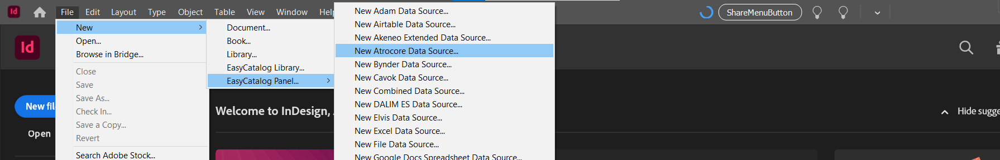{.large}

Enter valid information in the form.

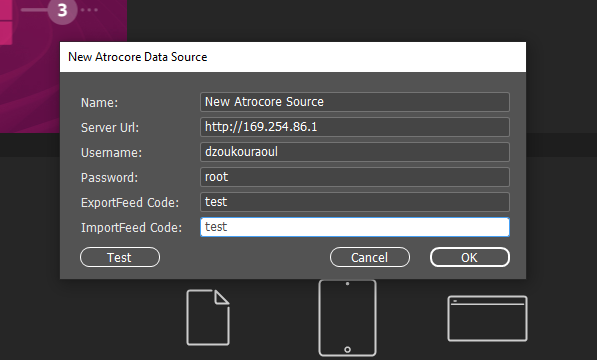{.large}

| Field | Description | Example |
|-------|-------------|---------|
| **Name** | Display name for this data source in EasyCatalog | `Product Catalog 2025` |
| **Server URL** | Full URL of your PIM instance | `https://yourcompany.atropim.com/` |
| **Username** | PIM user with export/import [access rights](../../02.atrocore/03.administration/14.access-management/03.roles/docs.md#authorizations-and-access-levels) for the target entity | `catalog_manager` |
| **Password** | Password for the PIM user account | `••••••••` |
| **Export Feed Code** | Unique code from your PIM Export feed configuration | `test` |
| **Import Feed Code** | Unique code from your PIM Import feed | `test` |

You can test your configuration by clicking on `Test` button and see the response from PIM.

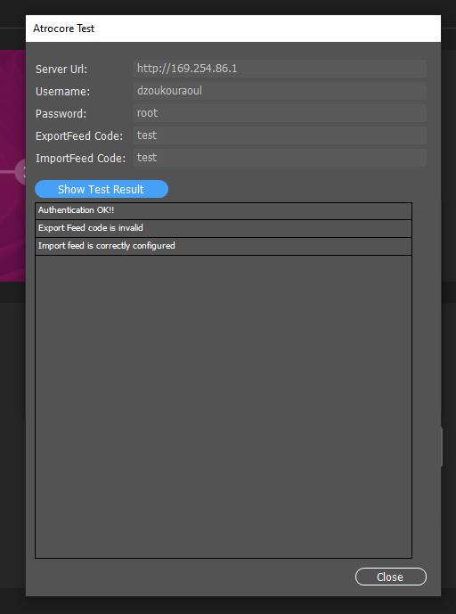{.large}

Click `Ok` on the form to get data from PIM and create a new EasyCatalog panel.

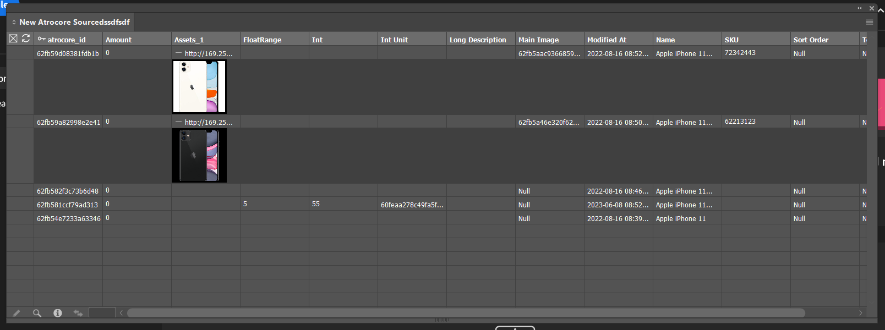{.large}

In the EasyCatalog panel: `Synchronize With Data Source` pulls data from PIM, `Update Data Source` pushes changes to PIM.