This module enables single sign-on (SSO) authorization in your AtroCore Application using Entra ID (formerly Azure Active Directory).

## User Functions

If authentication via Azure AD is activated in the administration of the system new button appears on the login page.

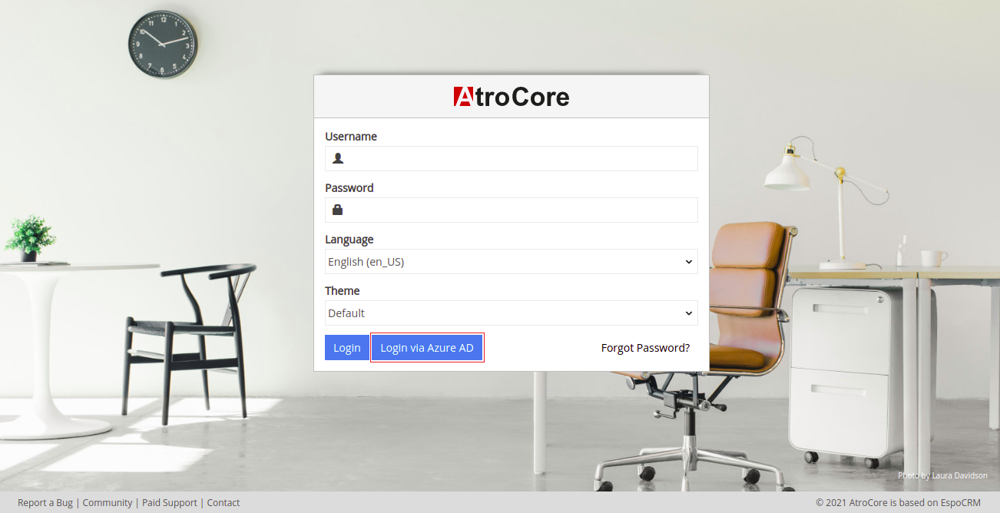{.large}

If you click on the button `Login via Azure AD` you will be redirected to Microsoft login page. After login there you will be redirected to Atrocore login page and will be authenticated fully automatically with your user account. If authorization fails, you will stay on the login page.

## Register new Application in Azure Active Directory

You need to register AtroCore Application in your Azure Active Directory. You should have admin account to be able to do that. Please go to https://portal.azure.com/ . There you see the list of all available Azure services. Choose Azure Active Directory.

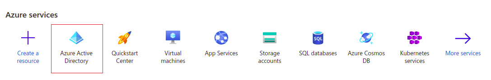{.large}

On the left context menu click on `App registrations`. You will see the list of available applications. To add a new application click on `New registration` button.

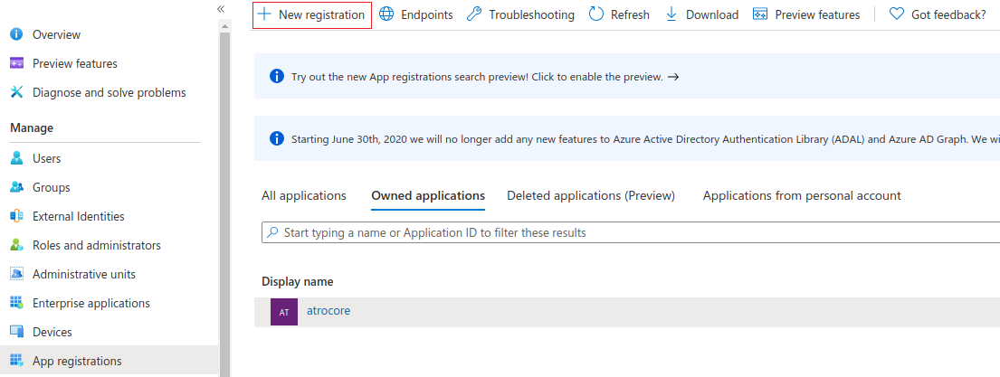{.large}

On the registration page you need to enter application name and choose the supported account type. Recommended - Accounts in this organizational directory only (Default Directory only - Single tenant). You also need to specify the Redirect URI, where Azure will redirect the user after he is successfully authenticated. Choose `Single-page application (SPA)` as app type for Redirect URI.

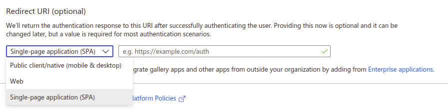{.large}

> The Redirect URI need to set in the next format: https://YOUR_PROJECT/api/v1/AzureAuth, where `YOUR_PROJECT` - domain name of your AtroCore application. This field should be always filled!

After saving the new registration you will be forwarded to the overview page. Here you can find the Application (client) ID, which will be needed for configuration in Atrore. So please save it somewhere.

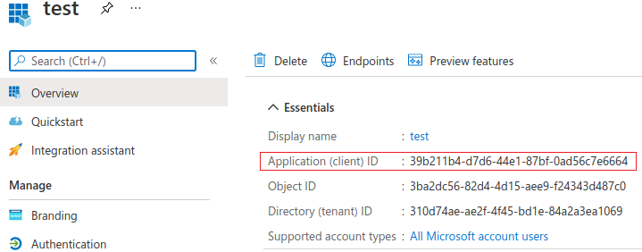{.large}

Go to Certificates & secrets page to create client secret string. Click on `New client secret` button.

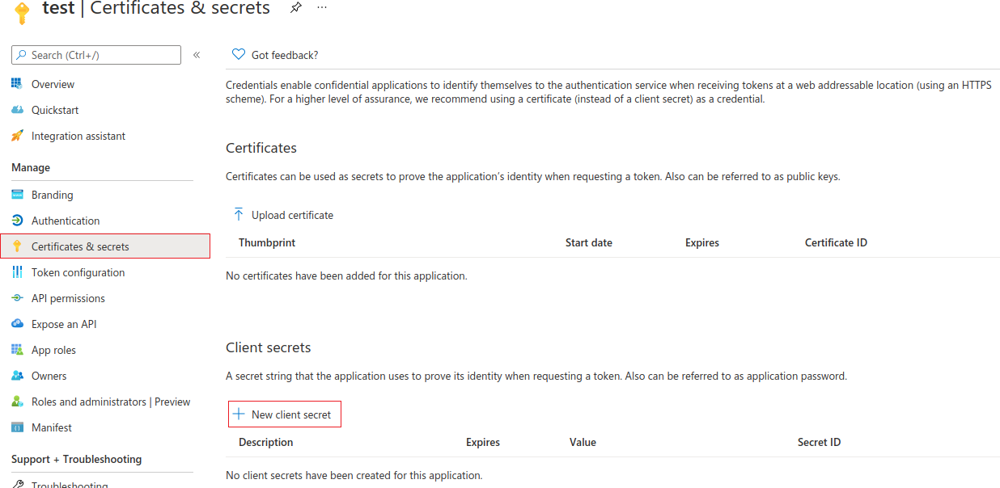{.large}

In modal window enter the secret description and time after which the client secret expires. Then click `Add` to save.

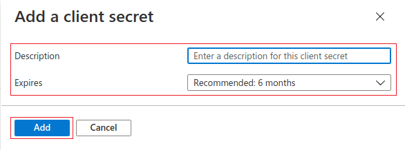{.large}

After this save the client secret value (not client secret id!). It will use in next step.

(**Optional**) Now you need to set the API permissions for your application. Go to the appropriate page, you will see a list of active permissions. Click on `Add new permission`. In "Microsoft Graph" block choose `Directory.Read.All` value and `Application` as a type.  After this click on `Grant admin consent`.

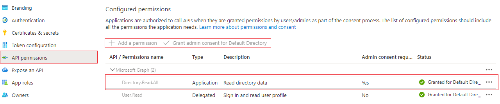{.large}

On Authentication page you can set Redirect URI if you have not done it before. Also in `Implicit grant and hybrid flows` block please select both `ID tokens (used for implicit and hybrid flows)` and `Access tokens (used for implicit flows)`.

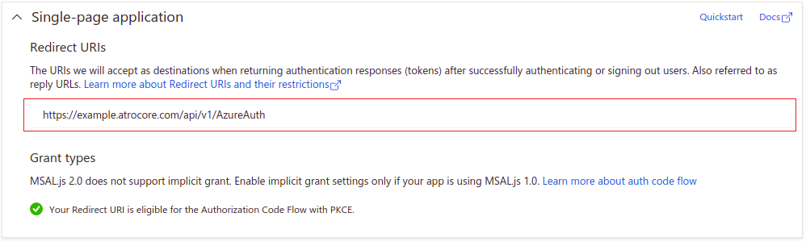{.large}

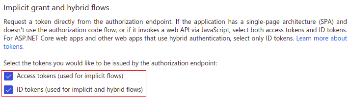{.large}

## Creating Azure Active Directory User

To create a new user in Active Directory login on https://portal.azure.com/ with your administrator account, choose Azure Active Directory service and click on `Users` link in left menu. There you can see the list of existing accounts.

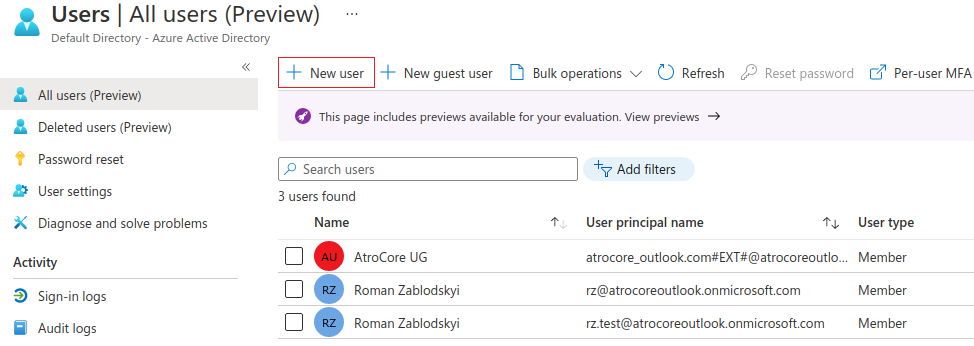{.large}

Click on the `New user` button to add new user.

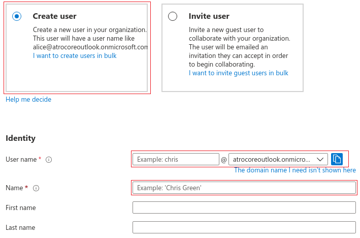{.large}

Choose `Create user` and fill all the necessary fields and click on `Create`. Click on new user, you have just created, from user list to see his detail information. Please note the `Object ID`, which you should fill on the user configuration page in the AtroCore Application.

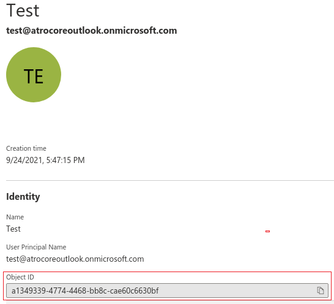{.large}

## Administrator Functions

### Module Configuration

After you have set up the new application registration and users in your Azure Active Directory you need to connect them with your AtroCore Application.

Go to `Administration > System > Authentication` page (https://YOUR_PROJECT/#Admin/authentication) and enter the `Application (Object) ID`, you have noted before, into the field `Azure Active Directory Client ID`. Also fill those fields - `Azure Active Directory Tenant ID` and `Azure Active Directory Client Secret` by appropriate values from Azure portal.

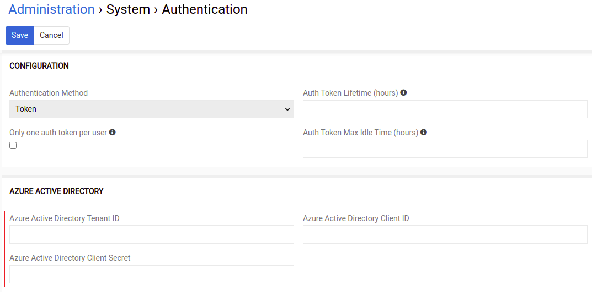{.large}

Make sure that you have set up the `Site URL` on `Administration > System > Settings` page (https://YOUR_PROJECT/#Admin/settings).

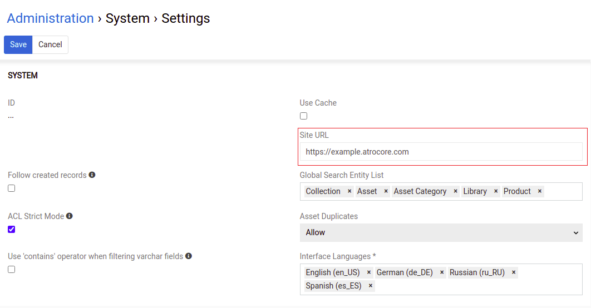{.large}

### User Configuration

To bind AtroCore user with Azure user, go to users list (https://YOUR_PROJECT/#User) and choose the necessary record. On Azure Active Directory panel set the `Azure User Object ID` field to the value your got from Azure `Object ID` field for a corresponding user.

If you already configured Azure Active Directory in "Administration > System > Authentication" and have enabled API access for AtroPIM application in Azure AD to read the user data, after you have filled the e-mail field, such fields as "First name", "Last name" and "Azure User Object ID" will be filled automatically, provided that user with such e-mail exists.

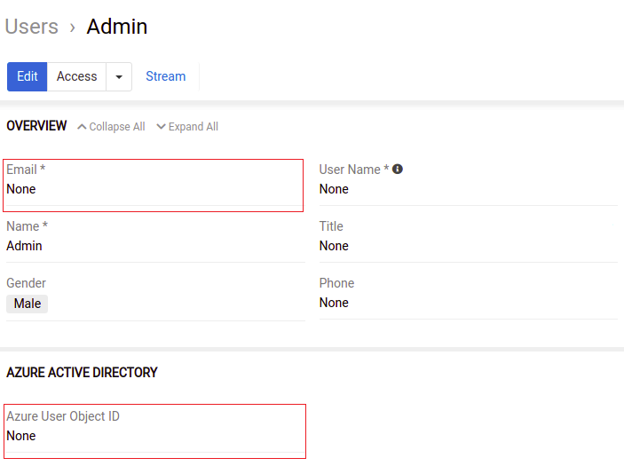{.large}
