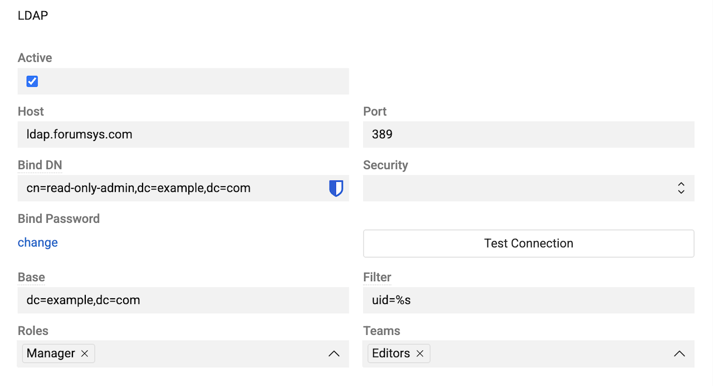
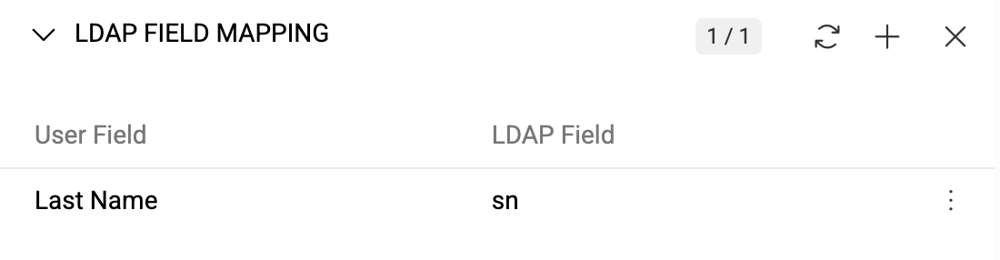
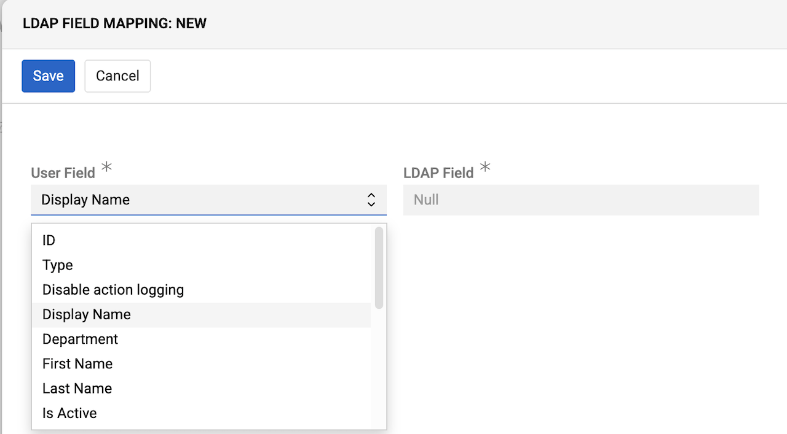
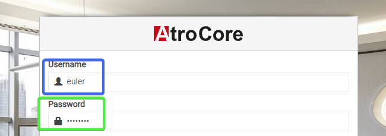
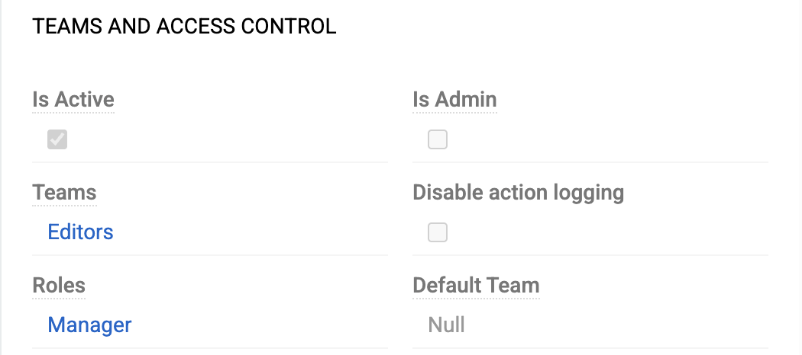

The [LDAP](https://store.atrocore.com/en/ldap/20164) module integrates AtroCore with your LDAP server, enabling centralized user authentication and eliminating the need to manage separate user accounts. User records are created automatically when users log in via LDAP for the first time, with default roles and teams assigned that can be modified in Administration.

Some users can log in using their LDAP server credentials, while others may authenticate with their AtroCore username and password.

> The PHP `ext-ldap` extension must be installed and enabled on your server for this module to work.

## Configuration

After the module is installed, the LDAP panel appears in [`Administration → Authentication`](../../01.atrocore/03.administration/14.access-management/05.authentication/docs.md). Activate LDAP Authentication and configure the connection to your LDAP server.

Connection details are available in your LDAP server configuration. The example uses the [LDAP test server](https://www.forumsys.com/2022/05/10/online-ldap-test-server).

{.large}

- **Host** – LDAP server IP address or hostname
- **Port** – connection port on which your directory server is listening
- **Bind DN** – distinguished name (DN) of the user that the application uses when connecting to the directory server. Recommended: an admin user with read-only access to search all LDAP users without modifying them
- **Password** – password for the admin user
- **Security** – SSL or TLS protocol
- **Base** – default base DN used for searching users
- **Filter** – filter used to select LDAP users who can log in to AtroCore

Click `Test Connection` to verify the connection. A successful connection displays `Connected` in the pop-up.

### LDAP Filter Queries

Use the `Filter` field to define filters for selecting LDAP users from your server. Use standard LDAP query syntax.

For examples, see:
- [ldapwiki.com – LDAP Query Examples](https://ldapwiki.com/wiki/Wiki.jsp?page=LDAP%20Query%20Examples)
- [atlassian.com – How to write LDAP search filters](https://confluence.atlassian.com/kb/how-to-write-ldap-search-filters-792496933.html)
- [theitbros.com – Active Directory LDAP Query Examples](https://theitbros.com/ldap-query-examples-active-directory/)

## Field Mapping

Define field mapping rules to map LDAP field values to AtroCore user fields, e.g., map the LDAP `surname` field to the `Last Name` user field.

Field information is updated automatically each time the user logs in.

{.medium}

Select any user profile field to update. Choose a field in your system and the corresponding field from your LDAP server.

{.medium}

!! You can select any LDAP field, including custom ones. However, be aware that validation may fail if the field does not meet requirements. Please choose fields carefully.

**Default Field Mappings**

If no custom mappings are configured, the following default logic applies:

**Name fields:**
- `sn` (surname) → `lastName`
- `cn` (common name) → `title`; also parsed: last word → `lastName`, remaining words → `firstName`
- `title` → `title` (overrides `cn` if present)

**Email fields:**
- `mail`, `email`, or `emailAddress` → `emailAddress` (first non-empty value, validated)

**Phone fields:**
- `mobile`, `phone`, or `phoneNumber` → `phoneNumber` (first non-empty value)

**Computed fields:**
- `name` is computed from `firstName` + `lastName`; if empty, falls back to `userName` (capitalized)

**Fallback defaults:**
- If `lastName` is empty, defaults to `userName`
- If `title` is empty, defaults to `userName`

Custom mappings configured in the Field Mapping section are applied after the defaults.

## User Login

Users log in using their Username (gid, which can be used as a separate group filter) and Password stored on the LDAP server.

{.large}

When a user logs in for the first time, a new user record is created in AtroCore. A default role and team are assigned automatically. Both can be changed by the administrator. See [Access management](../../01.atrocore/03.administration/14.access-management/) for details.

{.medium}
