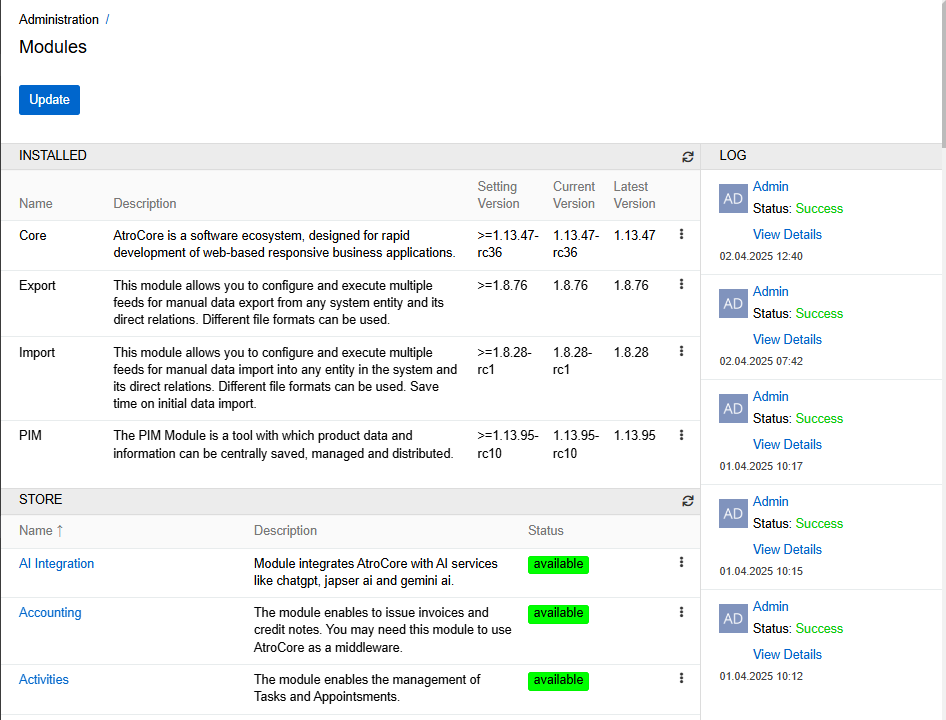
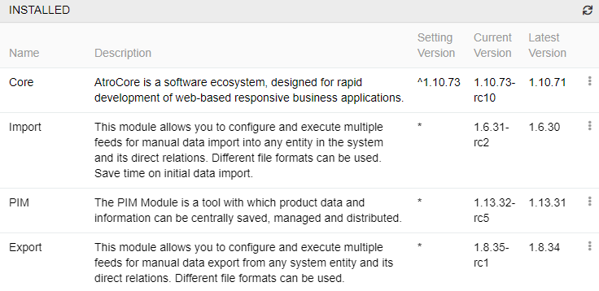
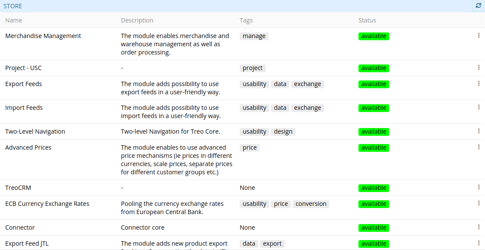
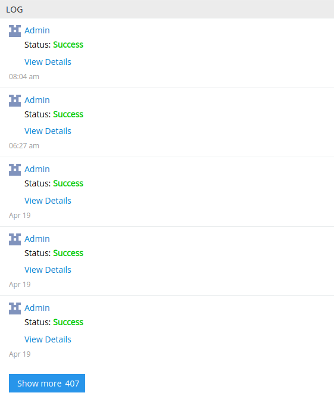
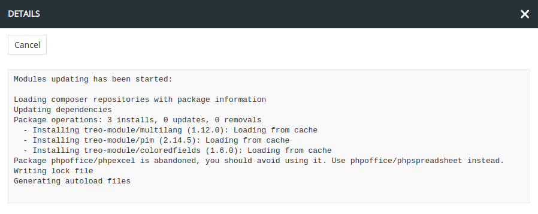
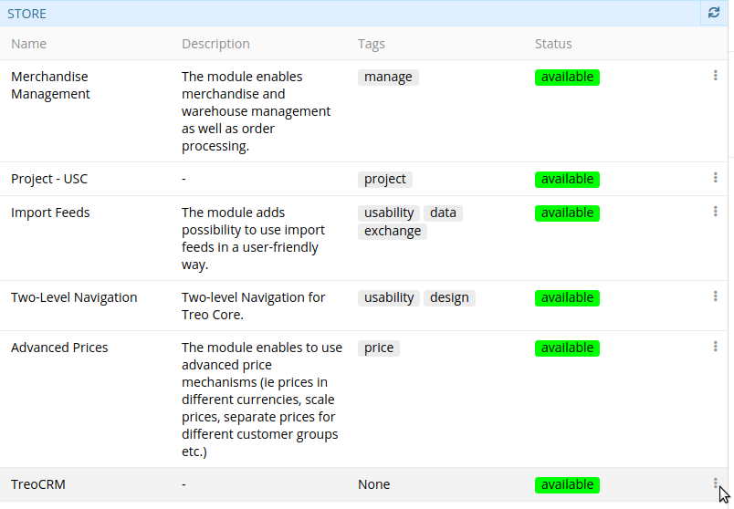
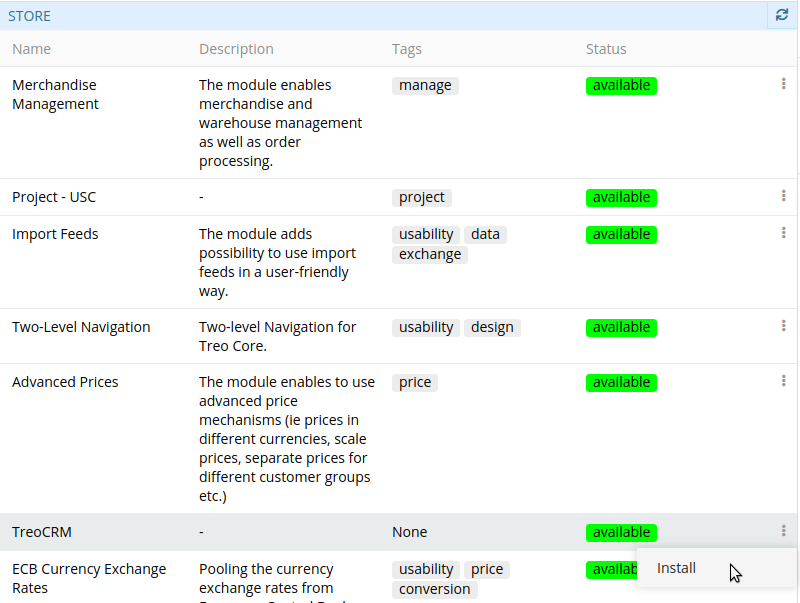
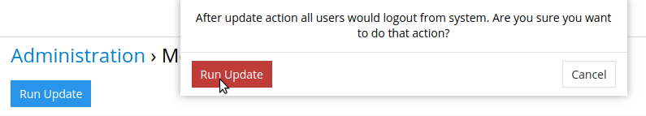
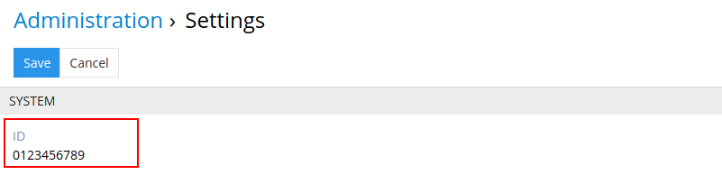

In AtroCore system you can install, update, and remove modules directly from the admin area.

To do it you need to go to "Administration > Module Manager" page.

{.large}

As you can see, this page consists of three panels:

* **Installed** – a list of modules installed in the system is displayed here along with the following data given in the corresponding columns: module name and description, setting version (* means the latest version), current version of AtroCore and required dependencies. You can manage versions of modules by selecting a set version (use * and a version of module to select the specified version of a module or ^ and a version of module to select a version of a module not lover than specified). The row action menu for each module may include a **Docs** option – if the module provides built-in documentation, clicking it opens the documentation portal in a new tab.

  

* **Store** – a list of all modules for AtroCore software platform is displayed here along with the description, tags, and status of each module. Tags identify modules by their main features to simplify your search for this or that module. For example: possibility to export or restore data, manage prices, etc. Management options are given in the "Status" column for each module separately.

  

* **Logs** – the history of all updates and upgrades performed by each system user is displayed here.

  

  To view detailed information about any operation, click "View Details"  for the desired operation:

  

Prior to installation, make sure that the module has the **available** status.

To install a module:

1. Go to "Administration > Module Manager".

2. Open the drop-down menu of the module to be installed:

   

3. Click the "Install" button.

   

   Having clicked "Install", AtroCore generates a schema with chosen module(s) and their dependencies for further installation.

4. To start the module(s) installation process, click on the button "Update" and confirm the action:

   

   During the update, you will see realtime logs to get actual information about the process.

## Module Update

The system is updated in the Module Manager. In the `Setting Version` column, you can manage the versions of the modules you want to update to. By default, the system will be updated to the highest possible version.
Here you can use the following operators:
- **>=1.0.4** or **^1.0.4** - the module will be upgraded to the highest possible version. The minimum possible version is 1.0.4.
- **1.0.4** - the module will be upgraded to version 1.0.4
- **>=1.0.0 <2.1** - the module will be updated to the highest possible version between 1.1.0 and 1.2
- **~1.0.4** - the module will be updated to a version that is greater than or equal to the specified version, but not greater than the current minor version. In this case, the module will not be able to upgrade to version 1.1.

> Please note, that you can only upgrade to a version that is greater than or equal to the current version of the module. Downgrade to previous versions is prohibited.

To update modules click on the button "Update". All the modules will be automatically updated. Before update is done the system makes a backup of itself and the database, to be able to be restored in case of unexpected problems.

> Please note, backup of your assets (files, which are stored in the system) is not done.

In order to avoid problems with migrations that may arise when upgrading to many minor versions at once, we introduced breakpoints - restrictions on the maximum possible upgrade version. Therefore, if you haven't updated your system for a long time, you will need to do it in a few steps. Currently, these breakpoints are Core versions "1.10.0","1.11.0", "1.12.1" and "1.13.5".

## Module Deletion

To delete a module from the system:

1. Go to "Administration > Module Manager".
2. Open the drop-down menu of the desired module from the "Installed" panel.
3. Click the "Delete" button.
4. Click on the button "Update".

## Restore a System

If the update can not be completed due to some error, you need to restore the system. Please run this command:

```
php composer.phar restore
```

You can force the restoration if the previous command does not help:

```
php composer.phar restore --force
```

You need to run the restore command as the webserver user, eg www-data, otherwise don't forget to change the ownership of the restored files.

## Consideration of the Dependencies

During the update process the system installs the latest available module versions. It is possible, that some modules will not be updated to the latest available version. The reason for it is the incompatibility of some of your modules with the newest version of the module you try to install.

## Module Purchase

You can see the whole list of AtroCore modules on our website: [English version](https://store.atrocore.com/en/), [German version](https://store.atrocore.com/de/).

Following status options are available for each module:

* **available** – module is available for installation
* **buyable** – module should be purchased, to be able to install it

The status is changed automatically from **buyable** to **available** after the module activation.
After you have purchased a module contact our support and provide your system IDs, which can be found on the "Administration > Settings" page. We need this ID to activate the module for your software instance. You can provide the IDs for your production, stage and testing environments.

In case of successful activation, the needed module will be switched to "available" within a few several minutes.

{.large}

### Purchase Conditions
The price stated on the website does not include VAT. For the price stated you will get the module including updates and upgrades for one year. After that, you may still use your last version of the module, or purchase the module again with a 50% discount, which gives you a right to updates and upgrades for an additional year. Furthermore, our [EULA](https://atropim.com/eula) (End-User License Agreement) will apply.

