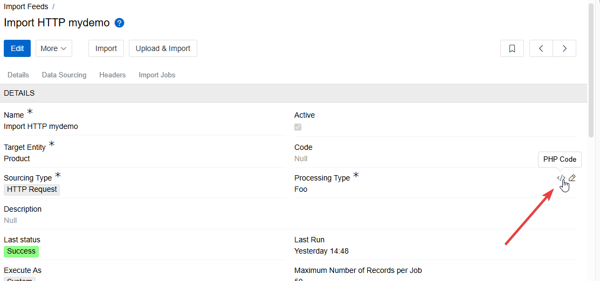
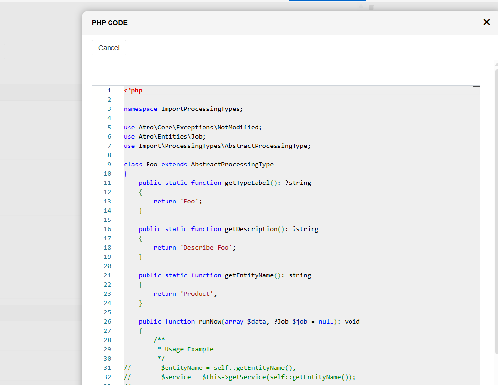

## Overview

Our system already provides a flexible and powerful framework for configuring import feeds, allowing users to define how external data is integrated into the platform.

To extend this flexibility even further, we introduced a new advanced option called **Processing Type for Import Feeds**, which allows developers to implement custom import logic directly in code. This approach is intended for technical users who need full control over the data handling process and want to bypass the standard configuration flow for performance or complexity reasons.

---

## Purpose

This feature allows developers to define custom logic for processing import data using code, bypassing the visual configurator and avoiding unnecessary format transformations.

---

## Use Cases

- High-volume or performance-critical imports  
- Custom pre-processing or transformation needs  
- Replacing or extending the limitations of the built-in configurator  
- When the source file has a complex or deeply nested structure  
- When additional data needs to be fetched or joined during import execution  
- When data needs to be transformed "on the fly" using conditional logic

---

## Benefits

- ✅ **Performance** – Reduces resource usage not only by avoiding format conversions (e.g., JSON to CSV), but also by skipping the overhead of the visual configurator. In the traditional setup, the configurator consumes resources to parse, normalize, and prepare the data based on dynamic mapping. With custom processing types, developers have full control and can write optimized code tailored to the exact structure of the input data.
- ✅ **Flexibility** – Complete control over how data is handled and transformed.
- ✅ **Extensibility** – Easily extendable by creating multiple processing types as needed.

---

## New Field: `Processing Type`

A new field called `Processing Type` was added to the **Import Feed** entity.  
It determines how the incoming data will be processed.

- Default value: `Configurator` (legacy visual mapping).
- New option: Custom class-based `Processing Type`.

---

## Creating a Custom Processing Type

To create a new processing type, run the following command on the server:

```bash
php console.php create import processing type Foo
```

Where Foo is the name of the new processing type.

This command generates a class inside the `ImportProcessingTypes` namespace.  
Developers can implement the custom import logic in this class.

---

## Example Class

```php
namespace ImportProcessingTypes;

use Atro\Core\Exceptions\NotModified;
use Atro\Entities\Job;
use Import\ProcessingTypes\AbstractProcessingType;

class Foo extends AbstractProcessingType
{
    public static function getTypeLabel(): ?string
    {
        return 'Foo';
    }

    public static function getDescription(): ?string
    {
        return 'Describe Foo';
    }

    public static function getEntityName(): string
    {
        return 'Product';
    }

    public function runNow(array $data, ?Job $job = null): void
    {
        $entityName = self::getEntityName();
        $service = $this->getService($entityName);
        $importJobId = $data['data']['importJobId'] ?? null;
        $rowNumber = 0;

        while (!empty($inputData = $this->getInputData($data))) {
            foreach ($inputData['list'] ?? [] as $item) {
                if (empty($item['name'])) {
                    continue;
                }

                $log = $this->getEntityManager()->getEntity('ImportJobLog');
                $log->set([
                    'type'        => 'skip',
                    'entityName'  => $entityName,
                    'importJobId' => $importJobId,
                    'rowNumber'   => $rowNumber
                ]);

                $product = $this->getEntityManager()->getRepository('Product')
                    ->where(['name' => $item['name']])
                    ->findOne();

                $input = new \stdClass();
                $input->name = $item['name'];

                try {
                    if (empty($product)) {
                        $product = $service->createEntity($input);
                        $log->set('type', 'create');
                        $log->set('entityId', $product->get('id'));
                    } else {
                        $service->updateEntity($product->get('id'), $input);
                        $log->set('type', 'update');
                        $log->set('entityId', $product->get('id'));
                    }
                } catch (\Throwable $e) {
                    if (!$e instanceof NotModified) {
                        $message = empty($e->getMessage()) ? $this->getCodeMessage($e->getCode()) : $e->getMessage();
                        $log->set('type', 'error');
                        $log->set('message', $message);
                    }
                }

                $log->set('row', $input);
                $this->getEntityManager()->saveEntity($log);
                $rowNumber++;
            }
        }
    }
}
```

## Key Methods

| Method                      | Description                                                                                           |
|----------------------------|-------------------------------------------------------------------------------------------------------|
| `getTypeLabel()`           | Returns the label for the processing type. Shown in the UI drop-down for Import Feed configuration.  |
| `getDescription()`         | Returns the description. This will be auto-filled into the `Description` field during Import Feed creation if the user selects this processing type and no description is set manually. |
| `getEntityName()`          | Returns the name of the entity for which this Processing Type is applicable. |
| `runNow(array $data, ?Job $job)` | Core logic for executing the import job. Developers should implement data parsing and processing here.    |

---

## UI Preview of Custom Code

To improve developer experience, the system provides a convenient way to preview the implementation of a custom Processing Type directly from the UI.

- Clicking this icon opens a preview of the code behind the selected type.
  
- The modal window that appears after clicking the icon. It contains a read-only view of the corresponding PHP class, making it easy to inspect the logic without leaving the UI.
  

This feature is intended to make debugging and reviewing logic easier for developers and administrators.