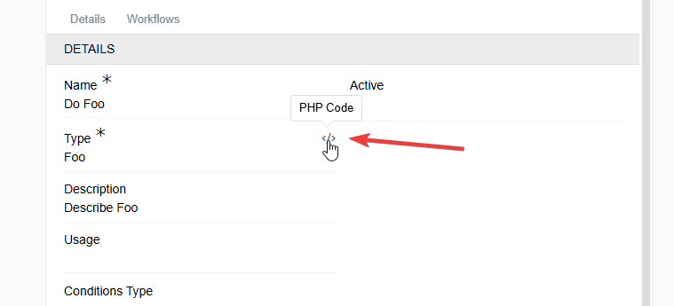
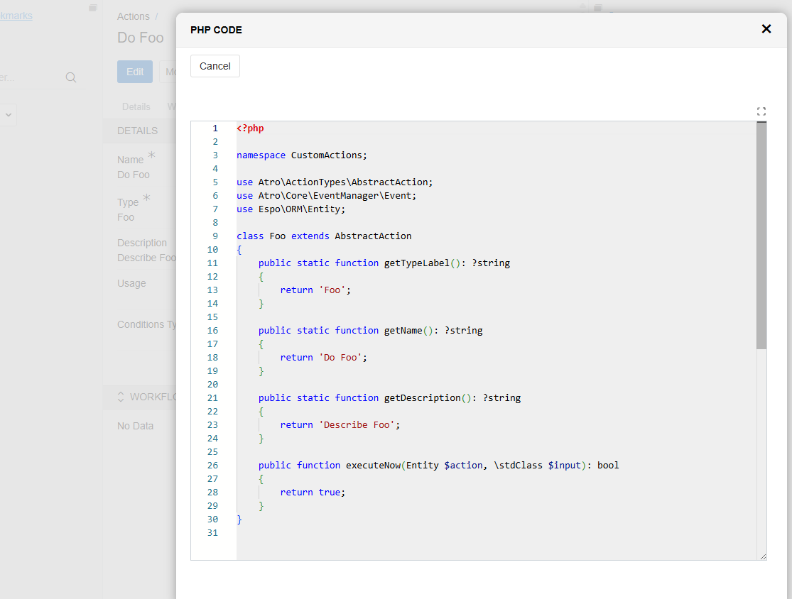

## Overview

The system features a flexible and extensible framework for configuring **Actions**, allowing users to define and customize various automated tasks. While a wide range of standard action types with configurable options is already available, the system also supports the development of **custom action types** to address specific or complex use cases that require bespoke logic beyond standard configurations.

## Purpose

The purpose of custom action types is to provide a flexible mechanism for implementing complex or unique business logic that cannot be efficiently handled by the standard predefined action types. This enables the system to be extended easily to meet specific requirements without compromising performance or maintainability.

## Use Cases

- Implementing specialized workflows unique to certain business processes.
- Performing optimized operations that standard action types cannot efficiently execute.
- Integrating with external systems or APIs with custom logic.
- Automating tasks that require complex conditions or calculations.
- Adding new types of automated actions without modifying the core system.

## Benefits

- **Flexibility:** Allows developers to implement any required logic tailored to specific needs.
- **Performance:** Enables optimized execution for complex or resource-heavy tasks.
- **Extensibility:** Supports seamless system extension without core modifications.
- **Maintainability:** Centralizes action logic, simplifying updates and debugging.
- **Consistency:** Custom actions integrate fully with existing UI and trigger mechanisms.


## Creating a Custom Action Type

Developers can create a new custom action type by running the following command on the server:

```bash
php console.php create action Foo
```
Here, `Foo` is the name of the new action type.

This command generates a PHP file on the server with a skeleton class, for example:

```php
<?php

namespace CustomActions;

use Atro\ActionTypes\AbstractAction;
use Atro\Core\EventManager\Event;
use Espo\ORM\Entity;

class Foo extends AbstractAction
{
    public static function getTypeLabel(): ?string
    {
        return 'Foo';
    }

    public static function getName(): ?string
    {
        return 'Do Foo';
    }

    public static function getDescription(): ?string
    {
        return 'Describe Foo';
    }

    public function executeNow(Entity $action, \stdClass $input): bool
    {
        return true;
    }
}
```

## Key Methods

| Method Signature                                    | Description                                                                                     |
|---------------------------------------------------|-------------------------------------------------------------------------------------------------|
| `getTypeLabel()`  | Returns a short label identifying the action type. Example: `'Foo'`.                           |
| `getName()`       | Returns the default name of the Action type. If the user selects this action type but does not provide a custom name, the system uses this value automatically. Example: `'Do Foo'`.              |
| `getDescription()`| Returns the default description of the Action type. If the user does not provide a description during creation, the system uses this value. Example: `'Describe Foo'`.                |
| `executeNow(Entity $action, \stdClass $input)` | Contains the main execution logic of the action. |

---

## UI Preview of Custom Code

To improve developer experience, the system provides a convenient way to preview the implementation of a custom Action directly from the UI.

- Clicking this icon opens a preview of the code behind the selected type.
  
- The modal window that appears after clicking the icon. It contains a read-only view of the corresponding PHP class, making it easy to inspect the logic without leaving the UI.
  

This feature is intended to make debugging and reviewing logic easier for developers and administrators.