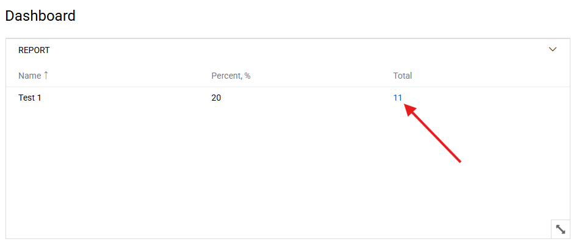
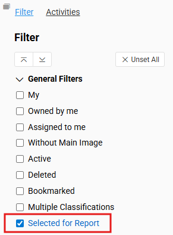

## Overview

Reports provide a way to aggregate and present data by grouping, filtering, and calculating values across entities.
While the default report types cover the most common scenarios, sometimes more advanced or specialized logic is
required.

Custom Report Types allow developers to define how report data is structured, filtered, and displayed, extending beyond
the system’s built-in functionality.

## Built-in Report Types

The system provides a few predefined report types for common scenarios, such as:

- **Summary** – aggregate and group data, showing totals and counts.
- **Crosstable** – present pivot-style data with rows and columns for comparison.

When these standard options are not enough, you can implement your own Custom Report Type.

## Use Cases for Custom Report Types

- Aggregating data across multiple related entities.
- Applying non-standard filters or business rules.
- Displaying data with special calculated metrics.
- Integrating external datasets into the reporting system.

## Defining a Custom Report Type

To define a new custom report type, run the following command on the server:

```bash
php console.php create report type DemoReport
```

> `DemoReport` is the name of your custom report class.

In result, the system generates a PHP file with the following structure:

```php
<?php

namespace CustomReportTypes;

use Atro\ORM\DB\RDB\Mapper;
use Doctrine\DBAL\ParameterType;
use Doctrine\DBAL\Query\QueryBuilder;
use Reports\DashletType\DashletTypeInterface;
use Espo\ORM\Entity;
use Reports\DTOs\DashletData;
use Reports\DTOs\Collection;
use Reports\DTOs\DashletDataColumn;
use Reports\DTOs\DashletGridData;
use Reports\ReportType\CustomReportTypeInterface;
use Slim\Http\Request;

class DemoReport implements DashletTypeInterface, CustomReportTypeInterface
{
    public static function getReportTypeLabel(): string
    {
        return 'Label for DemoReport';
    }

    public static function getEntityName(): string
    {
        return 'Product';
    }

    public function getDashletData(Entity $report): DashletData
    {
        return new DashletData([
            'id'         => $report->get('id'),
            'type'       => $report->get('type'),
            'name'       => $report->get('name'),
            'entityName' => self::getEntityName(),
            'columns'    => new Collection([
                new DashletDataColumn([
                    'name'  => 'name',
                    'label' => 'Name'
                ]),
                new DashletDataColumn([
                    'name'  => 'percent',
                    'label' => 'Percent, %'
                ]),
                new DashletDataColumn([
                    'name'     => 'total',
                    'label'    => 'Total',
                    'function' => 'custom'
                ])
            ])
        ]);
    }

    public function dashletList(Entity $report, Request $request): DashletGridData
    {
        $result = [
            'total' => -1,
            'list'  => [
                [
                    'id'      => '1',
                    "name"    => 'Test 1',
                    "percent" => 20,
                    "total"   => 11
                ]
            ]
        ];

        return new DashletGridData($result);
    }

    public function filteringByTotal(QueryBuilder $qb, Entity $entity, array $params, Mapper $mapper): void
    {
        $alias = $mapper->getQueryConverter()->getMainTableAlias();

        $qb->andWhere("$alias.is_active=:true")
            ->setParameter('true', true, ParameterType::BOOLEAN);
    }
}
```

Generated file will be located in `data/custom-code/CustomReportTypes/DemoReport.php`.

> Custom report types should implement both `DashletTypeInterface` and `CustomReportTypeInterface` interfaces.

## Key Methods

| Method Signature                                                                           | Description                                                                                               |
|--------------------------------------------------------------------------------------------|-----------------------------------------------------------------------------------------------------------|
| `getReportTypeLabel()`                                                                     | Returns the label displayed in the UI when selecting this report type.                                    |
| `getEntityName()`                                                                          | Defines the entity the report is associated with.                                                         |
| `getDashletData(Entity $report)`                                                           | Returns metadata for the report. Columns define how data is displayed and whether they support filtering. |
| `dashletList(Entity $report, Request $request)`                                            | Returns the dataset for the report. Each row must contain an `id` and values for all defined columns.     |
| `filteringBy{ColumnName}(QueryBuilder $qb, Entity $entity, array $params, Mapper $mapper)` | Implements custom filtering logic for a column declared with `'function' => 'custom'`.                    |

## Column Filtering

If a column should be filterable, add `'function' => 'custom'` in the column definition:

```php
new DashletDataColumn([
    'name'     => 'total',
    'label'    => 'Total',
    'function' => 'custom'
])
```

You must then provide a corresponding method:

```php
public function filteringByTotal(QueryBuilder $qb, Entity $entity, array $params, Mapper $mapper): void
{
    $alias = $mapper->getQueryConverter()->getMainTableAlias();
    $qb->andWhere("$alias.is_active = :true")
       ->setParameter('true', true, ParameterType::BOOLEAN);
}
```

! You can access row data using `$params['reportSpecific']['rowData']` array. It can be useful when you need to apply a
! filter based on some column value in the current row.

To apply the filter, the user must click the value in the column:

{.large}

After clicking the value, a new page with the filtered results will be opened in the new tab. There will be applied
boolean filter `Selected for Report`:

{.medium}
