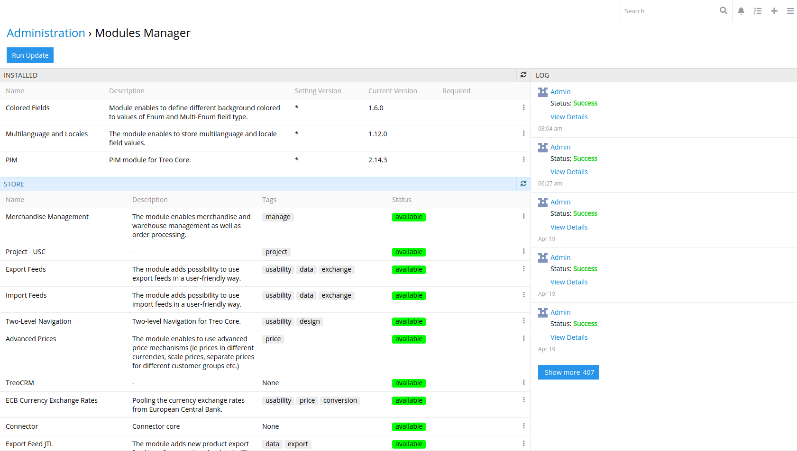
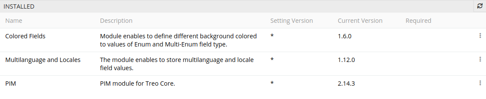
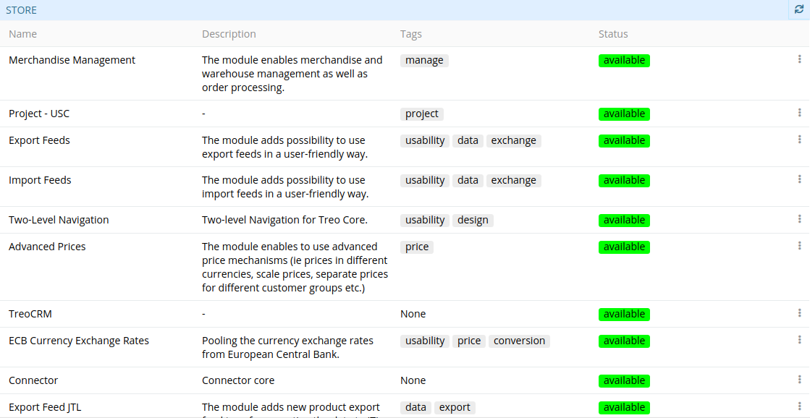
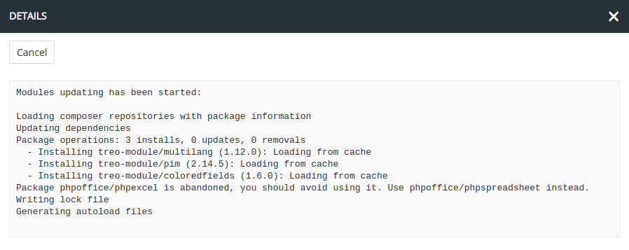
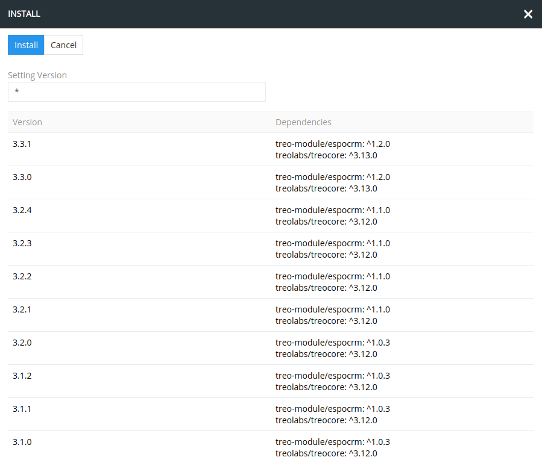
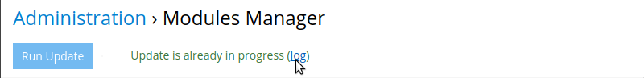

## Modules Manager

The Modules Manager mechanism is available for you in AtroCore to install, update, and remove modules – extensions that add new or expand the existing functionality.

Modules Manager is located on the Administration > Modules Manager page.

As you can see, the Modules Manager insterface consists of three panels:

* **Installed** – a list of modules installed in the system is displayed here along with the following data given in the corresponding columns: module name and description, setting version (* means the latest version), current version of AtroCore and required dependencies.

  
  
* **Store** – a list of all modules supported by AtroCore is displayed here along with the description, tags, and status of each module. Tags identify modules by their main features to simplify your search for this or that module. For example: possibility to export or restore data, manage prices, etc. Management options are given in the "Status" column for each module separately. See the details in the [Module Buying](#module-buying) section.   

  

* **Logs** – the history of operations performed by each system user in the Modules Manager is displayed here.

  
  
  To view detailed information about any operation, click "View Details"  for the desired operation:
  
  

#### Module Buying

For a start, visit our store for details: [English version](https://atropim.com/store), [German version](https://atropim.com/de/shop).

In AtroCore the following status options are available for each module:

* **available** – available for installation;
* **buyable** – there is no access to module.

To change the status from **buyable** to **available** after the confirmation of module purchase, please contact our support and provide your system ID, which can be found on the Administration > Settings page. In case of success, the needed module will be available in AtroStore within a few several minutes.
<!-- давайте зробимо інтерактивним слово support, щоб по кліку на нього відкривалося вікно створення нового листа з імейлом нашого сапорту в полі To -->
    

#### Module Installation

Prior to installation, make sure that the module has the **available** status. See the details in the [Module Buying](#module-buying) section.

To install a module:

1. Go to Administration > Modules.
2. Open the drop-down menu of a needed module:

   
3. Click the "Install" button.

   
4. Choose the version to install. You can define the module version manually or set "*" to get the latest version:

   
   
   Having clicked "Install", AtroCore generates a schema with chosen module(s) and their dependencies for further installation.

5. To start the module(s) installation process, click "Run Update" and confirm the action: 
   
   

   During the update, you can call realtime logs to get actual information about the process:
   
   

#### Module Update

To update a module version:

1. Go to Administration > Modules Manager.
2. Open the drop-down menu of the desired module from the "Installed" panel.
3. Click the "Update" button.
4. Choose the version to update to.
5. Click "Run Update".

#### Module Deletion

To delete a module from the system:

1. Go to Administration > Modules Manager.
2. Open the drop-down menu of the desired module from the "Installed" panel.
3. Click the "Delete" button.
4. Click "Run Update".
