## Multilingualism

### Configuration 

To configure the multi-languages settings, go to `Administration > Multi-Languages`:

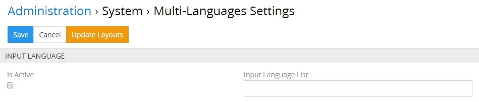

By default, the `Is active` checkbox and the `Input Language List` field are deactivated, as shown on the screenshot above.

To enable the function for inputting the field values in multiple languages, select the `Is active` checkbox and choose the desired languages from the drop-down list that appears once you click the `Input language list` field:

To change the languages for which the multilingual fields must be filled (e.g. delete the previously defined locales, add new ones), also use the `Input Language List` setting.

When turning off a certain language, the input field and its value will be removed both from the database and system interface. You will be notified about it with the following warning message:

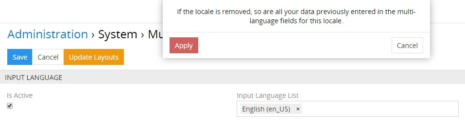

If this language is turned on again, the input fields will be restored to the system interface, but with no data in them. So please, be careful with these actions.

You can automatically update the layouts for all entities to include locale fields on the ones where the main multilingual field is already displayed. To do this, click the `Update Layouts` button and confirm your decision in the pop-up that appears:

Once the action is applied, the missing locale fields are added at the bottom of the entity records overview. To customize the field order display, go to the [Layout Manager](#multilingual-field-display-on-the-layout) and make the desired changes for each entity separately. Moreover, you can configure each layout for each multilingual field separately as described [below](#multilingual-field-display-on-the-layout).

### Multilingual Field Creation 

Currently the following field types can be made multilingual in the TreoPIM system:

| **Field Type** | **Description**                                           |
|----------------|-----------------------------------------------------------|
| Boolean        | Checkbox for the product attribute that can be added for each active locale                                                                   |
| Enum           | Field type for storing drop-down list values for each active locale with the ability to select only one of the variants                        |
| Multi-Enum     | Field type for storing drop-down list values for each active locale with the ability to select one or more variants                            |
| Text           | Field type for storing long text values in multiple languages    |
| Varchar        | Field type for storing short text values (up to 255 characters) in multiple languages                                                         |
| Wysiwyg        | Field type for storing long multiline texts in multiple languages, which contains separate built-in text editors for each active locale |

To create a field that can be made multilingual, go to `Administration > Entity Manager` and click `Fields` for the desired entity:

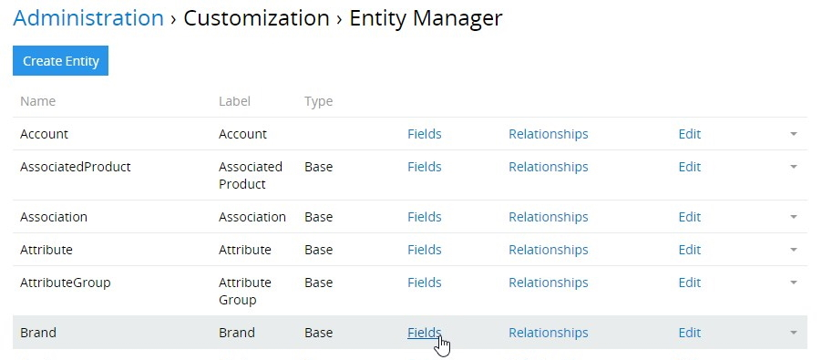

In the new window that opens, all fields of the selected entity are displayed. Click the `Add Field` button, select one of the field types that can be made multilingual:

On the entity field creation page that opens, specify all necessary parameters for this field and select the `Multi-Language` checkbox to enable automatic creation of multilingual fields via cloning the given main field:

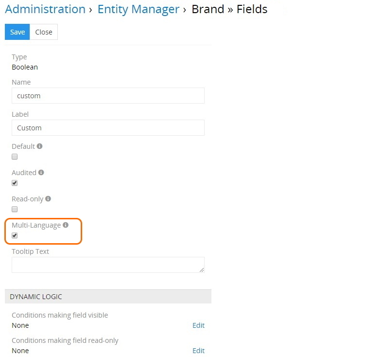

As a result, several entity field records will be created – the main one and locale fields in as many languages as there are activated on the ["Multi-Languages Settings"](#module-configuration) page:

Names and labels of multilingual fields include names of their locales: "en_US", "de_DE", etc.

> If your system is already integrated with an external system, and you make a simple field multilingual (i.e. set a `Multi-Language` checkbox for it), you may need to change the mapping to ensure correct work with the external systems.

### Multilingual Fields Editing

To edit a multilingual field, either main or locale, click its name on the entity fields list view page and make necessary changes on the page that opens:

By default, the locale fields inherit all settings from their main multilingual field, i.e. if the `Audited` checkbox is selected in the main multilingual field on its creation and/or editing, it is automatically selected for the locale fields. However, once a locale field is edited, it loses its inheritance and is assigned its individual value. To discard all changes in the locale fields and return the values of the main multilingual field, use the `Reset to default` button on the locale field detail view page:

Please, note if the main multilingual field is mandatory, so are its all locale fields and the `Required` checkbox disappears from the locale field detail view page:

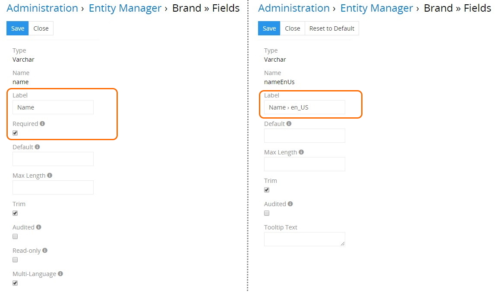

Moreover, input of values in the given multilingual fields is also required for all languages activated in the TreoCore system. Learn more about TreoCore and its advantages [here](https://treopim.com/help/what-is-treocore).

The	`DYNAMIC LOGIC` panel settings are not inherited – it is configured separately for each multilingual field:

### Multilingual Field Display on the Layout

To display the newly created multilingual field(s), go to `Administration > Layout Manager` and click the desired entity in the list to unfold the list of layouts available for this entity. Click the layout you wish to configure (e.g. `List`) and enable the created field by its drag-and-drop from the right column to the left:

Please, note that adding the main multilingual field to the layout does not lead to automatic adding of its locale fields – each field is added separately for each layout type.  

Click `Save` to complete the operation. The added field will be displayed on the configured layout type for the given entity:

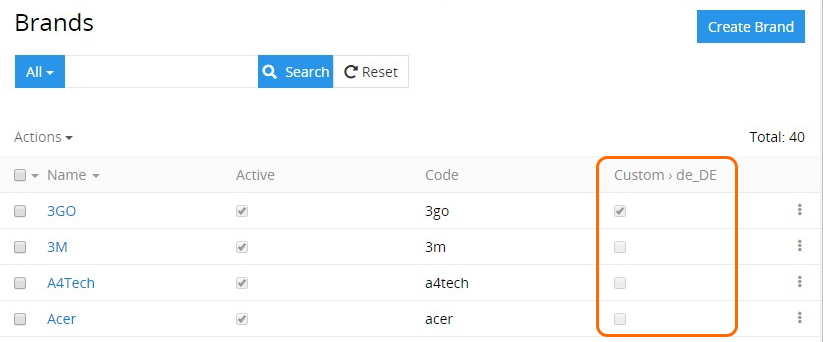

To customize the fields display for other layout types of the entity, make similar changes to the desired layout types in the Layout Manager, as described above. 

#### Search Filters

In the same way, multilingual fields can also be added to the [search filters](https://treopim.com/help/search-and-filtering) list in the Layout Manager:

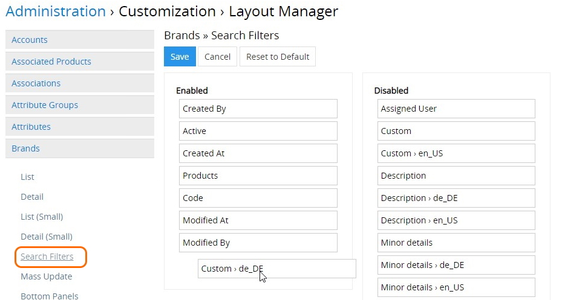

#### Mass Update

To activate the [mass update](https://treopim.com/help/views-and-panels#mass-actions) of the entity records by multilingual fields, click `Mass Update` and drag-and-drop the desired fields one by one to the `Enabled` column:

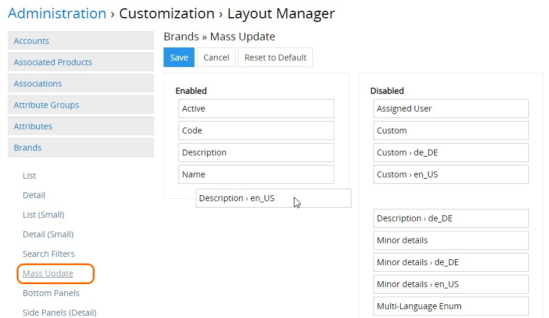

Please, note that mass update for multilingual `Enum` / `Multi-Enum` fields is performed on the basis of their main field values, and the corresponding values in their locale fields  are updated automatically.

### Multilingual Fields Removal

To remove the entity field with the activated `Multi-Language` checkbox, click `Remove` on the entity fields list view page and confirm your decision in the pop-up that appears:

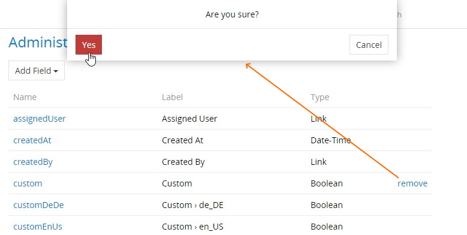

Please, note that locale fields cannot be removed apart from their main multilingual field. To do this, you need to either remove the selection of the `Multi-Language` checkbox on the main field editing page or remove the main multilingual field from the system as it is described above. 
 
### Access Rights

Multilingualism supports the ability to grant separate roles *different* read/edit permissions to multilingual fields. To do this, go to `Administration > Roles > 'Role name'` and on the role detail view page click the `Edit` button:

  

On the `FIELD LEVEL` panel of the role edit view page that opens, find the entity you wish to configure, click `+` next to it and in the pop-up that appears click the multilingual field to be used as a filter for the given entity:

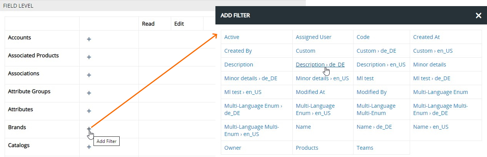

Please, note that you can add as many fields as needed, selecting them one by one.

For the added multilingual fields configure read/edit rights via the corresponding drop-down lists:

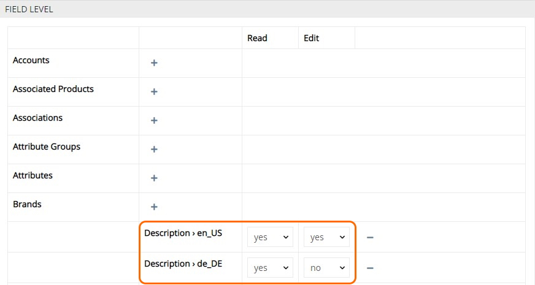

Use `-` to remove the unnecessary field(s).

