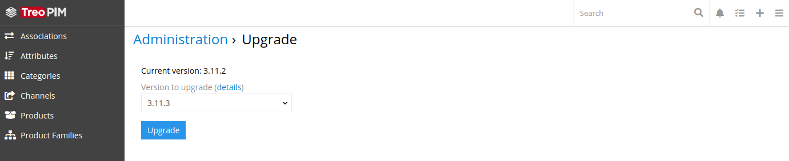
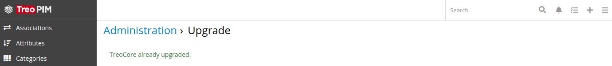
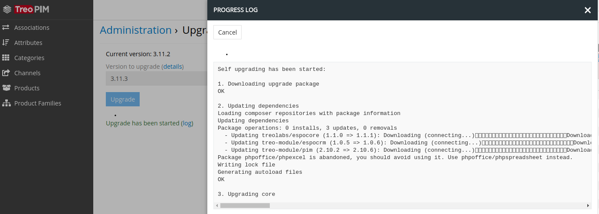

## Upgrading

AtroCore system provides two ways of upgrading – from user interface and terminal.

#### Upgrade from UI

Steps to upgrade your AtroCore using UI:

1. Check your current version of AtroCore

    Go to the Administration > Upgrade page.

    There you can get current version of system and available versions for upgrade with detail information about them.
        
    
        
    If your version of AtroCore is up-to-date you will get a corresponding message.
            
    
    
2. Run upgrade

    Click "Upgrade" button to start upgrade process of your AtroCore system. When process started you can view real time upgrade information in logs.

    

    After successful upgrading current user will be logout from system.

#### Upgrade from CLI
Command to run system upgrading from terminal:
```
php console.php upgrade <versionTo> <action>
```
, where are the next parameters:
* ``<versionTo>`` – target system version. If needed version don't exist you will get a corresponding message;
* ``<action>`` – additional parameter, that define type of the upgrading. There are two values available:
    - ```--download``` – automatically download required upgrade packages, based on your current version, and stored it in `data/upload/upgrades` folder;
    - ```--force``` – will make backup of current system version and run upgrade after downloading needed packages.

After upgrading with `--force` action you should update dependencies with `composer update` command.
