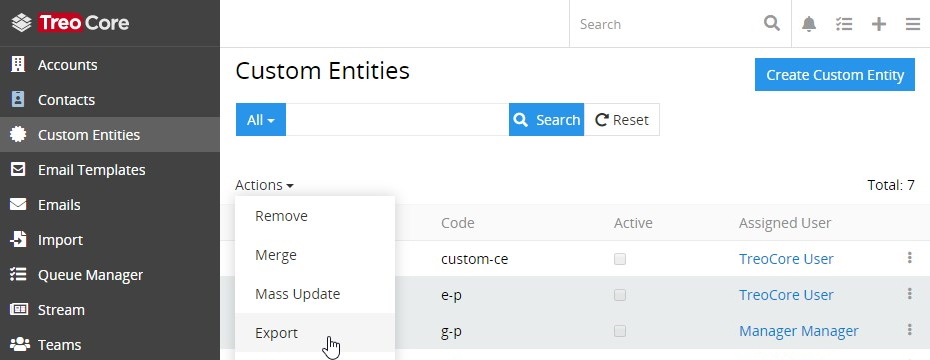
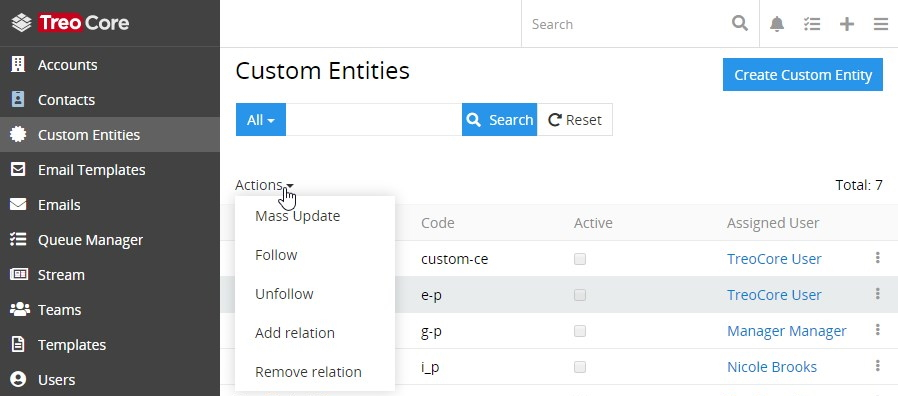

# Export

The data exporting feature comes with the AtroCore system out of the box and is available on any entity [list view](./views-and-panels-core.md#list-view) page. It allows you to export the desired data fields in the XLSX (Excel) or CSV format.

> To have more advanced export options (e.g. export product attribute values, product images/assets, channels, etc.), get the **"Export Feeds" module**. The details are available in the [AtroPIM store](https://atropim.com/store/export-feeds).

## Setup

Open any entity list view page, select the desired record(s) and click the `Export` option in the mass actions menu:

The following setup pop-up will appear:

Here you can select the export file format (XLSX or CSV) from the drop-down list, and define the fields to be exported or select the `Export all fields` option to export all fields available in the given entity.

By default, the required fields are displayed in the `Field list` box, but you can modify the list, if needed.

## Running Export

To start exporting the data, click the `Export` button in the setup pop-up – the export file will be downloaded in the defined format.

## Export Permissions

By default, data export is enabled for all AtroCore users. However, export permissions can be disabled by the administrator. In this case, the `Export` option will not be shown in the mass actions menu:

> To get the data export ability back, please, contact your administrator.

