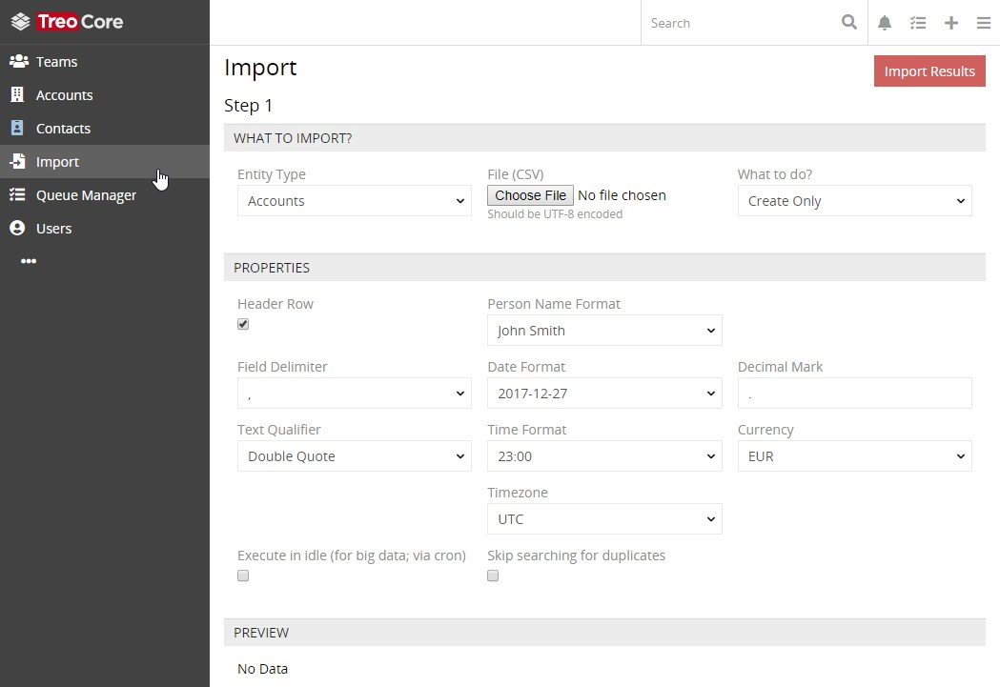
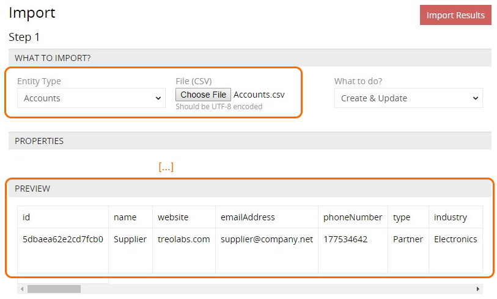
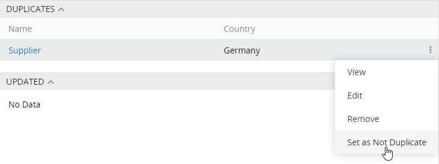
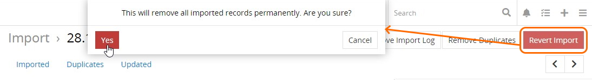

# Import

Data import is a separate AtroCore system [entity](./what-is-atrocore.md#concept-of-entity) that comes out of the box. It allows you to import the data from CSV files. 

`Import` can be added to the [navigation menu](./user-interface-core.md#navigation-menu) on the user preferences page via activating the `Custom tab list` option and adding the corresponding tab.

> To have more advanced import options (e.g. import product attribute values, product images/assets, product categories, etc.), get the **"Import Feeds" module**. The details are available in the [AtroPIM store](https://atropim.com/store/import-feeds).

## Setup

To configure an import operation, click `Import` in the navigation menu – the setup page `Step 1` will open:

On the `WHAT TO IMPORT?` panel, select the desired entity type and action to be performed using the corresponding drop-down lists. The following import actions are available in AtroCore:

- **Create Only** – new data records will be created;
- **Update Only** – data in the already existing records will be updated;
- **Create & Update** – new data records will be created and the existing records will be updated.

Click the `Choose File` button to load the import file in the CSV format. All the data in this file should be UTF-8 encoded. As a result, the `PREVIEW` panel display will be updated according to the defined entity type and template file:

 

On the`PROPERTIES` panel, define the desired parameters for the import data display or make no changes to leave the default options:

Activate the `Header row` checkbox to include the column names in the import file or leave it deselected to skip column names from importing. For large files with a lot of records to be imported, activate the `Execute in idle` checkbox. In this case, the import operation will be processed by cron. To skip searching for duplicates during the data import, select the corresponding checkbox.

Click the `Next` button to move to `Step 2` of the import process setup and configure the field mapping parameters, i.e. the correspondence of the fields to the columns of the defined CSV import file:

To skip the unnecessary columns, select the `Skip` option in the appropriate field drop-down list:

If the `Update Only` or `Create & Update` action option is defined on `Step 1`, you need to also specify fields, by which records to be updated will be found. For this, select the appropriate `Update by` checkbox. For example, if the `ID` field is set as to be updated by, then records with the matching ID will be updated during the import process. 

You can also add more fields for import and their default values on the `DEFAULT VALUES` panel:

Click the blue `x` button to remove the added field and/or its default value.

Please, note that once the import operation is [completed](#import-results), you will be able to revert the created records, view the updated ones and duplicates (if there were any similar records in the system).

If you need to make changes on `Step 1`, click the `Back` button. To proceed to the import operation, click the `Run Import` button. If a lot of data needs to be imported, the operation may be time consuming. In this case, setting the `Execute in idle` checkbox is a recommended setting.

## Import Results

Once the import operation is completed, the [detail view](./views-and-panels-core.md#detail-view) page of the current import result record with the import details opens:

The import result record name is generated automatically based on the date and time of the import operation. The import file in the CSV format can be downloaded right from this page, if needed. You can make changes in the downloaded import result file and [create](#setup) a new import operation on its basis, with the corrected data.

All the imported, duplicated, and updated records are listed on the corresponding panels. They can be viewed, edited, or removed via the corresponding options from the single record actions menu on the appropriate panels:

Additionally, on the `DUPLICATES` panel, you can mark the desired records as non-duplicates using the corresponding option from the single record actions menu:

 

Confirm your decision in the pop-up that appears – the given record will not be displayed on the `DUPLICATES` panel any more.

To remove all the duplicated records at once, click the `Remove Duplicates` button.

Having checked that all data is imported properly, click the `Remove Import Log` button in order to prevent accidental reverting of the import operation.

Once the imported data is no longer needed, click the `Remove Import` button and confirm your decision in the following message that appears:

