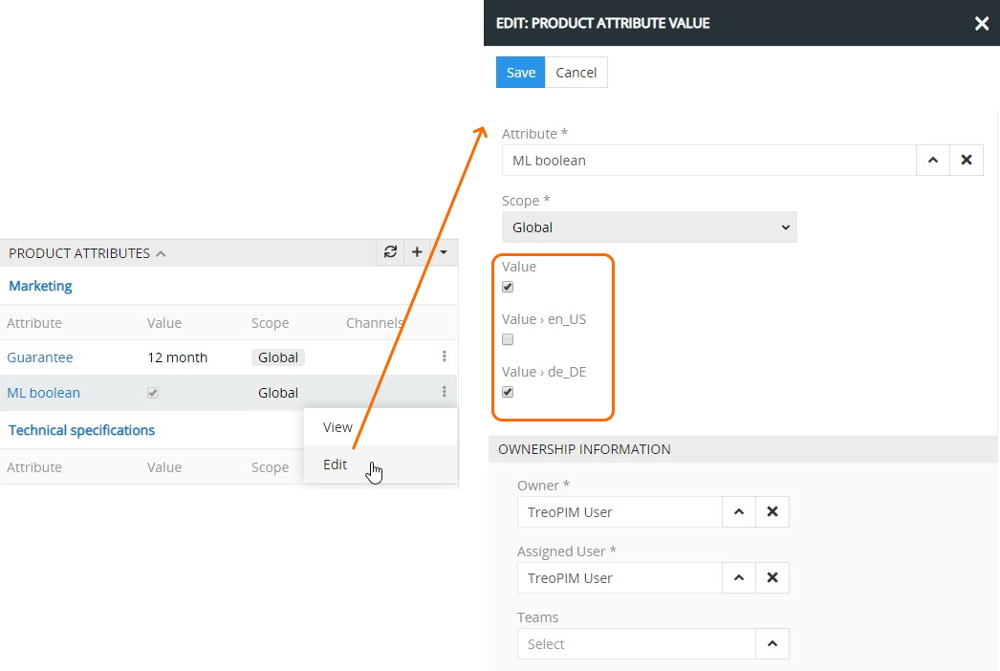

## Multilingualism

User can work with multilingual fields in accordance with his role rights that are predefined by the administrator.

The possible values of the `Enum` and `Multi-Enum` fields are specified for each language by the [administrator](#administrator-functions). For the `Enum` fields the default values, assigned by the administrator, are displayed, and for the `Multi-Enum` fields, users can select the desired options from the existing values:

 

For the fields of the `Text`, `Varchar`, and `Wysiwyg` types, the additional input fields are displayed in accordance with the [layout configuration](#multilingual-field-display-on-the-layout) for all languages that have been activated in the [module settings](#module-configuration):  

### Multilingual Attributes

In addition to operating with multilingual fields, installing TreoPIM to your system will allow you to make [attributes](https://treopim.com/help/attributes) of the `Boolean`, `Enum`, `Multi-Enum`, `Text`, `Varchar`, and `Wysiwyg` type multilingual – there is the `Multi-Language` checkbox on their detail view pages:

To create a multilingual attribute, select the `Multi-Language` checkbox and fill in the required multilingual fields for all active locales:

When a multilingual attribute is linked to a [product](https://treopim.com/help/products#product-attributes) record, the value of its main locale is displayed on the `PRODUCT ATTRIBUTES` panel within the product detail view page:

To edit the given attribute's locale values, use the `Edit` option from its single record actions menu and make the desired changes in the pop-up that appears:

Alternatively, use the `View` option from its single record actions menu and click the `Edit` button in the quick detail pop-up.

### Multilingual Fields and Attributes Filtering

If [TreoPIM](https://treopim.com/help/what-is-treopim) is installed to your system, additional options are added to the `locales` filtering menu on the [product](https://treopim.com/help/search-and-filtering) detail view page:

Select the desired locale option to filter the product data display accordingly. 

Please, note that once a locale filter is applied, the `PRODUCT ATTRIBUTES` panel contains multilingual attributes of the given locale only.

Leave the `Show Generic Fields` checkbox selected to have the main multilingual field displayed as well or remove its selection to have only locale multilingual fields displayed.
