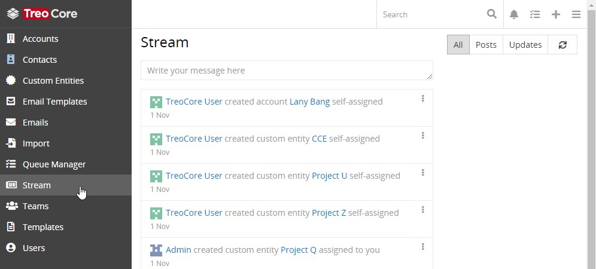
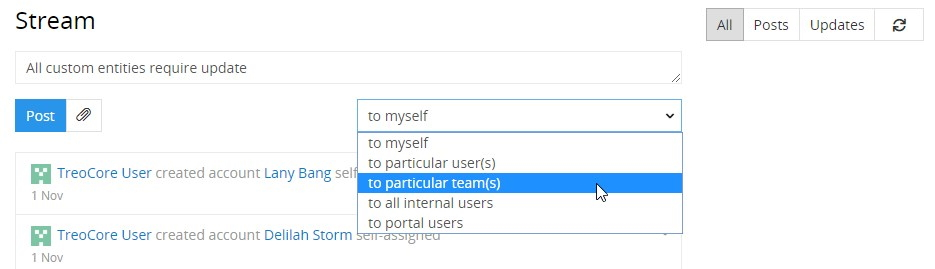
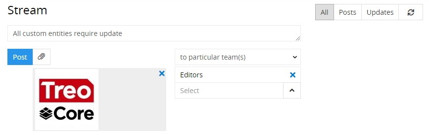
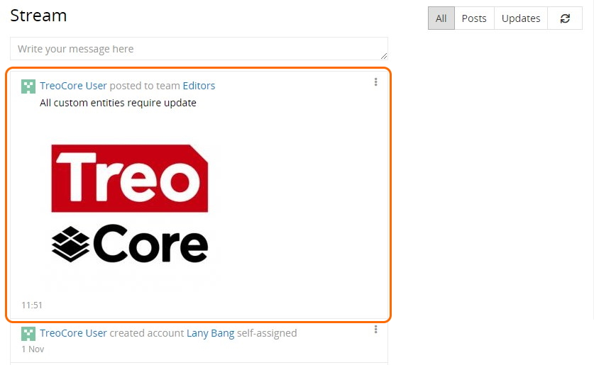
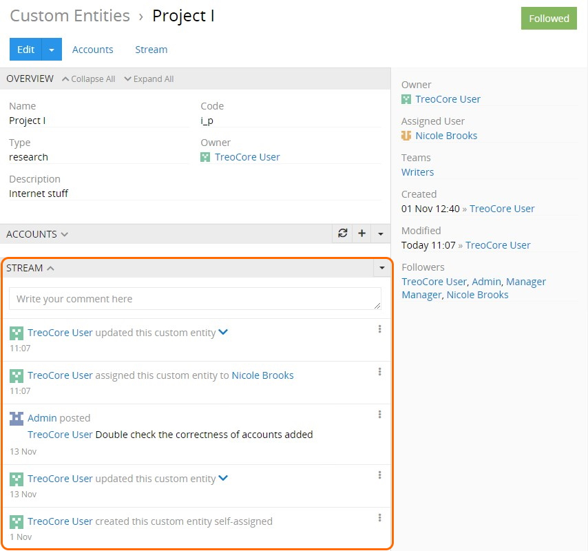

# Stream

Stream is a separate AtroCore [entity](./what-is-atrocore.md#concept-of-entity), which is used to display the entries of the [user activity](#user-activity-stream) and [entity records](#entity-records-stream).

> The stream display is enabled/disabled by the administrator for each entity separately, so if this feature is missing on any entity [detail view](./views-and-panels-core.md#detail-view) page, please, contact your administrator.

AtroCore supports the following **types** of stream entries:
- **Posts** – messages assigned to the current user by other system users, as well as his own messages posted in the stream, irregardless of the assignee.
- **Updates** – notifications about changes in the [audited](./what-is-atrocore-core.md#concept-of-data-auditing) fields of the user-related entries. *Please, note that entity fields are made audited only by the administrator.*
- **All** – general changes in the user- or entity-related actions.

## User Activity Stream

The user activity stream represents the list of activity records for the currently logged user, including the updates in the entity records followed by the user, as well as posts about user-related actions performed in the system. It can be added to the [navigation menu](./user-interface-core.md#navigation-menu) on the user preferences page via activating the `Custom tab list` option and adding the corresponding tab.

To open the user activity records list, click `Stream` in the navigation menu:

By default, all user-related activity records are displayed here in a chronological order. Click the `Posts` or `Updates` button to filter the records display by their type correspondingly:

To check for stream updates, click the refresh button:

When other users make changes in your user-related entity records or address stream posts to you, you will be informed about it via the `Notifications` pop-up:

### Creating a Post

To add a new post on the user activity records [list view](./views-and-panels-core.md#list-view) page, place the cursor in the text box, enter the desired message and assign it to a different user, if needed, by selecting the corresponding option from the user list:

You can also attach a file (or multiple files) to your post by clicking the attachment button and selecting the desired files:

Click the `Post` button – your message will appear on top of the stream list with all its details:

When the message is addressed to other users, they will also see this post on their user activity streams.

### Managing Posts

By default, posts and updates from the user activity stream can only be removed via the corresponding option from the [single record actions](./views-and-panels-core.md#single-record-actions) menu:

To complete the operation, you will need to confirm your decision in the pop-up that appears:

User added posts, however, can not only be removed, but also edited. For this, click the `Edit` option in the single record actions menu and make the desired changes in the editing pop-up that appears:

## Entity Records Stream

The entity records stream is displayed on the `Stream` panel on the [detail view](./views-and-panels-core.md#detail-view) page of the corresponding entity record:

Here the list of all actions related to the given entity record are displayed. 

> To be able to track changes in the entity record *fields*, please, contact your administrator.

Use the actions menu to filter the stream records by their type correspondingly:

Posts and updates from the entity records stream can be removed via the corresponding option from the single record actions menu and confirming the decision in the pop-up that appears:

*Please, note that the stream functionality can be further extended with the help of the **"Revisions"** module, which allows you to view the field changes history in the pop-up and restore previous values from the change history. Go to our [store](https://atropim.com/store/revisions) to learn more about the "Revisions" module.*

