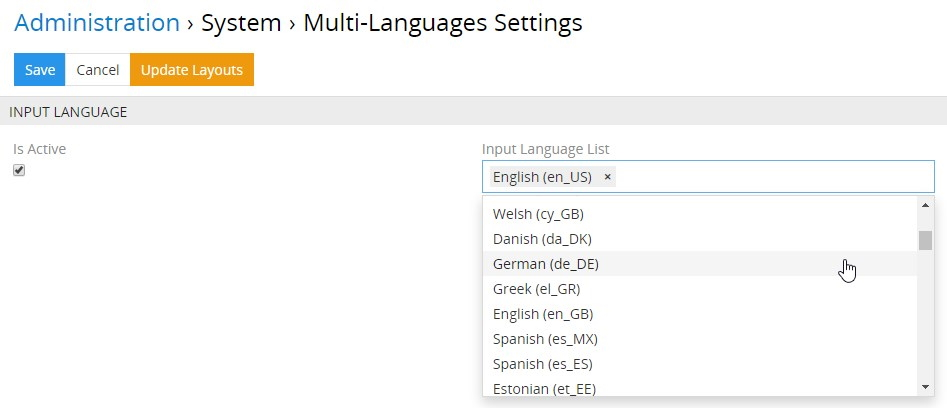
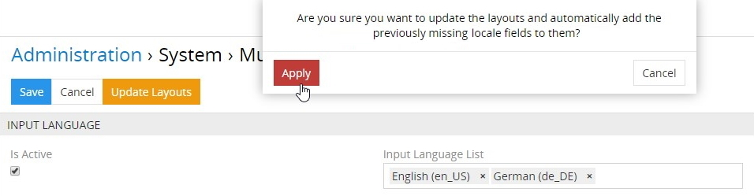
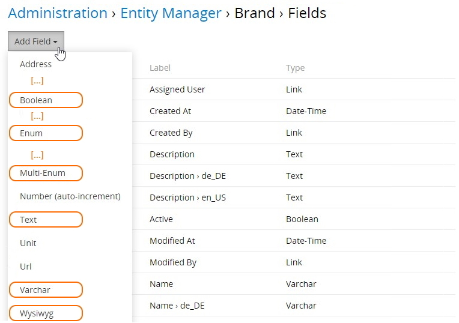
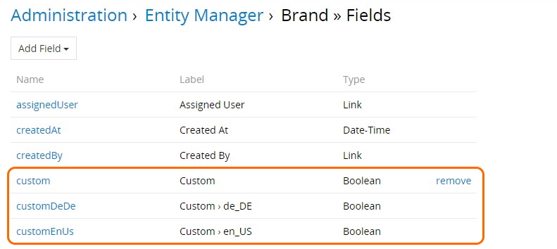
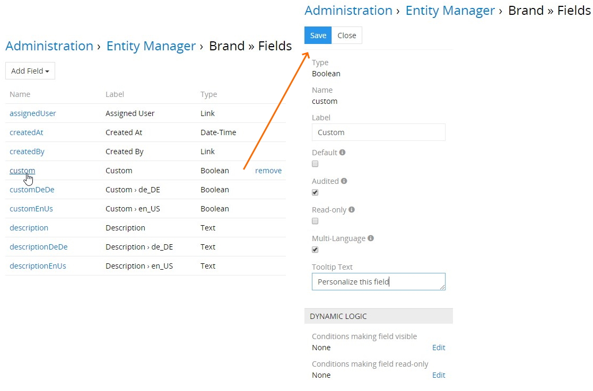
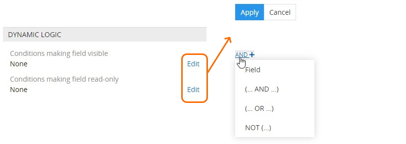
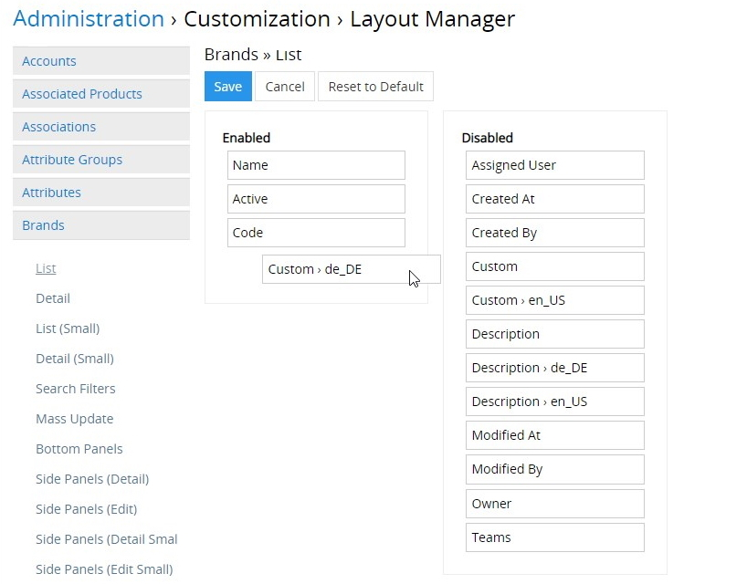
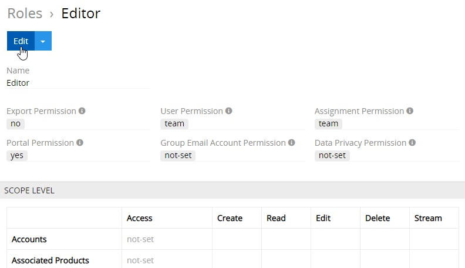
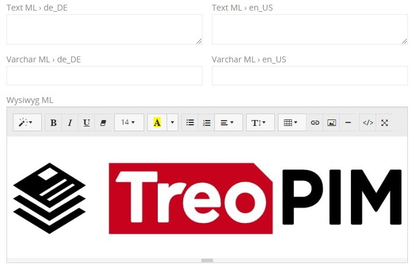
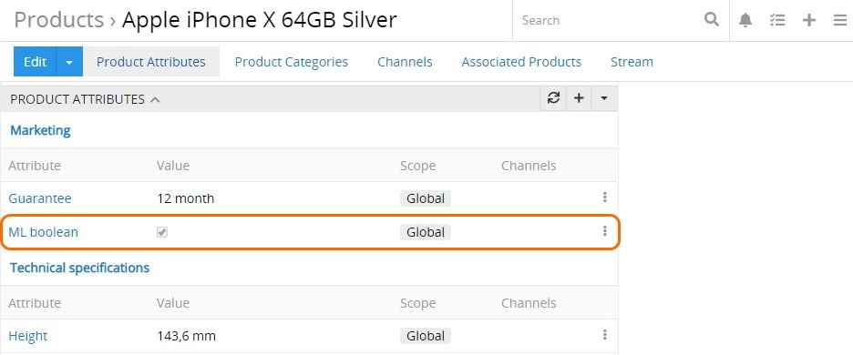

Das Modul "Multi-Languages" ermöglicht es, Ihre Daten in mehr als einer Sprache zu speichern, indem Sie zu Ihrem System so viele Locales wie nötig hinzufügen. Außerdem erlaubt es Ihnen, die Felder von Typen `Boolean`, `Enum`, `Multi-Enum`, `Text`, `Varchar` oder `Wysiwyg` für jede Entität im System mehrsprachig zu machen und Benutzerrollen unterschiedliche Lese- / Bearbeitungszugänge zu diesen mehrsprachigen Felder einzeln für jedes Locale zuweisen. 

## Installationsanleitung 

Das Modul "Multi-Languages" wird automatisch mit [TreoCore](https://treopim.com/help/what-is-treocore) installiert, aber wenn Sie es nicht haben, dann gehen Sie zu `Administration > Modul Manager`, suchen Sie dieses Modul in der Liste „Shop“ und klicken Sie auf `Installieren`:

Wählen Sie im angezeigten Installations-Pop-up die gewünschte Version aus und klicken Sie auf den Button `Installieren`. Der Modulhintergrund wird grün und das Modul wird in den Bereich „installiert“ des Modulmanagers verschoben. Klicken Sie auf `das Update starten`, um die Installation zu bestätigen.

> Bitte beachten Sie, dass nach dem Systemupdate alle Nutzer abgemeldet werden. 

Um das Modul „Multi-Languages“ zu aktualisieren / zu entfernen, nutzen Sie die entsprechenden Optionen aus der Drop-down-Liste für einzelne Datensatzaktionen in `Administration > Modul Manager`.

Außerdem wird das Modul „Multi-Languages“ zusammen mit [TreoPIM](https://treopim.com/help/what-is-treopim) installiert und TreoPIM-abhängig ist. Wenn also TreoPIM im System installiert ist, kann das Modul „Multi-Languages“ nicht entfernt werden.

## Funktionen für den Administrator  

### Konfiguration des Moduls 

Um die mehrsprachigen Einstellungen zu konfigurieren, gehen Sie zu  `Administration > Mehrere Sprachen > Einstellungen`:

Standardmäßig sind die Checkbox `Aktiv` und das Feld `Spracheingabe Liste` deaktiviert, wie auf dem Screenshot oben angezeigt wird.

Um die Funktion für die Eingabe von Feldwerten in mehreren Sprachen zu aktivieren, setzen Sie die Checkbox `Aktiv` und wählen Sie die gewünschten Sprachen aus der Drop-down-Liste aus, die angezeigt wird, nachdem Sie auf die `Spracheingabe Liste` geklickt haben:

Um die Sprachen zu ändern, für die die mehrsprachigen Felder ausgefüllt werden müssen (z.B. vorher definierte Locales entfernen, neue hinzufügen), nutzen Sie ebenfalls die Einstellung  `Spracheingabe Liste`. 

Beim Ausschalten einer bestimmten Sprache oder bei der Entfernung des Moduls „Multi-Languages“ werden das Eingabefeld und dessen Wert aus der Datenbank und dem Systeminterface entfernt. Sie werden darüber mit der folgenden Warnmeldung informiert:

Wenn diese Sprache jedoch wieder eingeschaltet oder das Modul neu installiert wird, werden die Eingabefelder im Systeminterface wiederhergestellt, aber ohne die Daten in diesen Feldern. Also, seien Sie bitte vorsichtig mit diesen Aktionen.

Auf derselben Konfigurationsseite des Moduls "Multi-Languages" können Sie die Layouts für alle Entitäten automatisch so aktualisieren, dass die Locale-Felder in den Layouts angezeigt werden, in denen das mehrsprachige Hauptfeld bereits angezeigt wird. Klicken Sie dazu auf den Button `Layouts aktualisieren` und bestätigen Sie Ihre Entscheidung im angezeigten Pop-up:

Wenn die Aktion ausgeführt wurde, werden die fehlenden Locale-Felder im unteren Bereich der Übersicht von Entitätsdatensätzen hinzugefügt. Um die Anzeige der Feldreihenfolge anzupassen, gehen Sie zum [Layout-Manager](#mehrsprachige-feldanzeige-im-layout) und nehmen Sie die gewünschten Änderungen einzeln für jede Entität vor. Außerdem können Sie jedes Layout für einzeln jedes mehrsprachige Feld auf die [unten beschriebene Weise](#mehrsprachige-feldanzeige-im-layout) konfigurieren.

### Erstellung der mehrsprachigen Felder

Derzeit können die folgenden Feldtypen im TreoPIM-System mehrsprachig gemacht werden:

| **Feldtyp** | **Beschreibung**                                             |
| ----------- | ------------------------------------------------------------ |
| Boolean     | Die Checkbox für das Produktattribut, das für jedes aktive Locale hinzugefügt werden kann |
| Enum        | Der Feldtyp zum Speichern mehrsprachiger Werte der Drop-down-Liste für jedes aktive Locale mit der Möglichkeit, nur eine der Varianten auszuwählen |
| Multi-Enum  | Der Feldtyp zum Speichern mehrsprachiger Werte der Drop-down-Liste für jedes aktive Locale mit der Möglichkeit, eine oder mehrere Varianten auszuwählen |
| Text        | Der Feldtyp zum Speichern langer Textwerte in mehreren Sprachen |
| Varchar     | Der Feldtyp zum Speichern kurzer Textwerte (bis zu 255 Symbole) in mehreren Sprachen |
| Wysiwyg     | Der Feldtyp zum Speichern langer mehrzeiliger Texte in mehreren Sprachen, der einzelne integrierte Texteditoren für jedes aktive Locale enthält |

Um ein Feld zu erstellen, das mehrsprachig gemacht werden kann, gehen Sie zu  `Administration > Entity Manager` und klicken Sie bei der gewünschten Entität auf `Felder`:

Im angezeigten Fenster werden alle Felder der ausgewählten Entität eingeblendet. Klicken Sie auf den Button `Feld hinzufügen` , wählen Sie einen der Feldtypen aus, der mehrsprachig gemacht werden kann:

Geben Sie auf der angezeigten Seite zum Erstellen von Entitätsfeldern alle erforderlichen Parameter für dieses Feld an und setzen Sie die Checkbox `Mehrsprachig`, um das automatische Erstellen mehrsprachiger Felder durch das Klonen des bestimmten Hauptfelds zu ermöglichen:

Als Ergebnis werden mehrere Datensätze der Entitätsfelder erstellt - das Hauptfeld und die Locale-Felder in so vielen Sprachen, wie es auf der Seite der ["Einstellungen von mehreren Sprachen"](#konfiguration-des-moduls) aktiviert wurde:

Die Namen und Bezeichnungen von mehrsprachigen Feldern enthalten den Namen ihres Locales: „en_US“, „de_DE“ usw.

> Wenn Ihr System bereits mit einem externen System integriert ist und Sie das einfache Feld mehrsprachig machen (z.B. Sie setzen die Checkbox `Mehrsprachig` für dieses Feld), müssen Sie möglicherweise das Mapping ändern, um die korrekte Arbeit mit den externen Systemen sicherzustellen.

### Bearbeitung der mehrsprachigen Felder

Um ein mehrsprachiges Feld (Haupt- oder Locale-Feld) zu bearbeiten, klicken Sie auf seinen Namen auf der Seite der Listenansicht von Entitätsfelder und nehmen Sie auf der angezeigten Seite die erforderlichen Änderungen vor:

Standardmäßig übernehmen die Locale-Felder alle Einstellungen aus ihrem mehrsprachigen Hauptfeld, d. h. wenn die Checkbox `Audited` im mehrsprachigen Hauptfeld bei seinem Erstellen und/oder Bearbeiten ausgewählt wurde, wird sie automatisch für die Locale-Felder ausgewählt. Wenn ein Locale-Feld bearbeitet wird, verliert es jedoch seinen übernommenen Wert und erhält den individuellen Wert. Um alle Änderungen in den Locale-Feldern zu verwerfen und die Werte  auf die Werte des mehrsprachigen Hauptfelds zurückzusetzen, klicken Sie auf der Detailansichtsseite des Locale-Felds auf den Button `Zurücksetzen auf Standard`:

Bitte beachten Sie, dass wenn das mehrsprachige Hauptfeld ein Pflichtfeld ist, sind dann alle seine Locale-Felder auch Pflichtfelder. Deshalb wird die Checkbox `Erforderlich` auf der Detailansichtsseite der Locale-Felder nicht mehr angezeigt:

Außerdem ist die Eingabe von Werten in die angegebenen mehrsprachigen Felder für alle aktivierten Sprachen im TreoCore-System  ebenfalls erforderlich. Erfahren Sie mehr über TreoCore und seine Vorteile [hier](https://treopim.com/help/what-is-treocore).

Die Einstellungen des Panels `DUNAMISCHE LOGIK` werden nicht übernommen. Sie sollen für jedes mehrsprachige Feld einzeln konfiguriert werden:

### Mehrsprachige Feldanzeige im Layout

Um die neu erstellten Felder anzuzeigen, gehen Sie zu  `Administration > Layout Manager` und klicken Sie auf die gewünschte Entität in der Liste, um die Liste der für diese Entität verfügbaren Layouts aufzuklappen. Klicken Sie auf das Layout, das Sie konfigurieren möchten (z.B. `Liste`), und aktivieren Sie das erstellte Feld durch drag-and-drop von der rechten Spalte in die linke:

Bitte beachten Sie, dass das Hinzufügen des mehrsprachigen Hauptfelds zum Layout nicht  zum automatischen Hinzufügen der Locale-Felder führt. Jedes Feld soll für jeden Layouttyp einzeln hinzugefügt werden. 

Klicken Sie auf `Save` um den Vorgang abzuschließen. Das hinzugefügte mehrsprachige Feld wird im konfigurierten Layouttyp für die gegebene Entität angezeigt:

Um die Feldanzeige für andere Layouttypen der Entität anzupassen, nehmen Sie ähnliche Änderungen an den gewünschten Layouttypen im Layout-Manager vor, wie oben beschrieben.

#### Suchfilter 

Auf die gleiche Weise können mehrsprachige Felder auch zu der Liste der [Suchfilter](https://treopim.com/help/search-and-filtering) im Layout-Manager hinzugefügt werden:

#### Massenaktualisierung 

Um [Massenaktualisierung](https://treopim.com/help/views-and-panels#mass-actions) der Entitätsdatensätze nach den mehrsprachigen Feldern zu aktivieren, klicken Sie auf `MASSENÄNDERUNG` und ziehen Sie die gewünschten Felder mithilfe von drag-and-drop eins nach dem anderen in die Spalte `Aktiviert`: 

Bitte beachten Sie, dass die Massenaktualisierung für mehrsprachige Felder von Typen `Enum`/`Multi-Enum` auf der Grundlage der Werte ihres Hauptfeldes durchgeführt wird und die entsprechenden Werte in ihren Locale-Feldern automatisch aktualisiert werden.

### Entfernung der mehrsprachigen Felder 

Um das Entitätsfeld mit der aktivierten Checkbox `Mehrsprachig` zu entfernen, klicken Sie auf `Entfernen` auf der Seite der Listeansicht von Entitätsfeldern und bestätigen Sie Ihre Entscheidung in der angezeigten Pop-up:    

Bitte beachten Sie, dass Locale-Felder separat von ihrem mehrsprachigen Hauptfeld nicht entfernt werden können. Dazu müssen Sie entweder die ausgewählte Checkbox `Mehrsprachig` auf der Bearbeitungsseite des Hauptfelds entfernen oder das mehrsprachige Hauptfeld auf die oben beschriebene Weise aus dem System entfernen.

> Bitte beachten Sie, dass, wenn das Modul "Multi-Languages" deaktiviert und / oder aus dem System entfernt wird, bleiben mehrsprachige *Hauptfelder* für die konfigurierten Entitäten mit ihren Werten erhalten, aber ihre *Locale*-Felder mit deren Werte werden entfernt. Außerdem verlieren diese Felder ihren mehrsprachigen Charakter (die Checkbox `Mehrsprachig` wird deaktiviert). Wenn das Modul erneut aktiviert wird, werden alle mehrsprachigen Felder des Locales und ihre Werte wiederhergestellt. Die Neuinstallation des Moduls führt jedoch dazu, dass nur Locale-Felder ohne deren Werte wiederhergestellt werden. Die Ausnahme bilden mehrsprachige Felder vom Typ `Varchar`. Ihre Werte werden auch für Locale-Felder wiederhergestellt.

### Zugangsrechte

Einer der Vorteile des Moduls "Multi-Languages" besteht darin, dass es die Möglichkeit unterstützt, separaten Rollen *unterschiedliche* Lese-/Bearbeitungsberechtigungen für mehrsprachige Felder zu gewähren. Gehen Sie dazu auf `Administration > Rollen > 'Rollenname'` und klicken Sie auf der Seite der Rollen-Detailansicht auf den Button `Bearbeiten`:

  

Im Panel `FELDEBENE` der angezeigten Seite zur Rollenbearbeitung muss man die zu konfigurierende Entität finden und auf `+` daneben klicken. Im angezeigten Popup-Fenster klicken Sie auf das mehrsprachige Feld, das als Filter für die angegebene Entität zu verwenden ist:

Bitte beachten Sie, dass Sie beliebig viele Felder hinzufügen können, dafür muss man diese einer nach dem anderen auswählen.

Für die hinzugefügten mehrsprachigen Felder konfigurieren Sie die Rechte zum Lesen und Bearbeiten über entsprechende Dropdown-Listen:

Verwenden Sie `-`, um unnötigte Felder zu entfernen.

## Funktionen für den Nutzer

Wenn das Modul "Multi-Languages" vom [Administrator](#administrator-functions) installiert und konfiguriert wurde, können die Nutzer mit mehrsprachigen Feldern gemäß den vom Administrator vordefinierten und ihnen zugewiesenen Rollenrechten arbeiten.

Die möglichen Werte der Felder `Enum` und `Multi-Enum` werden vom [Administrator](#administrator-functions) für jede Sprache angegeben. Für die `Enum`-Felder werden die vom Administrator zugewiesenen Standardwerte angezeigt, und für die `Multi-Enum`-Felder können die Nutzer die gewünschten Optionen aus den vorhandenen Werten auswählen:

Bitte beachten Sie, dass farbige Hervorhebungen von `Enum`- und `Multi-Enum`-Feldwerten durch das Modul ["Colored Fields"](https://treopim.com/store/colored-fields) aktiviert werden.

Für die Felder der Typen `Text`, ` Varchar` und `Wysiwyg` werden zusätzliche Eingabefelder entsprechend der [Layoutkonfiguration](#mehrsprachige-feldanzeige-im-layout) für alle Sprachen angezeigt, die in den [Moduleinstellungen](#konfiguration-des-moduls) aktiviert wurden:

### Mehrsprachige Attribute

Wenn Sie TreoPIM auf Ihrem System installieren, können Sie nicht nur mit mehrsprachigen Feldern arbeiten, sondern auch [Attribute](https://treopim.com/help/attributes) der Typen `Boolean`, `Enum`, `Multi-Enum`, `Text`, `Varchar` und `Wysiwyg` mehrsprachig machen - hierfür ist die Checkbox `Mehrsprachig` auf den Detailansicht-Seiten dienlich:

Um ein mehrsprachiges Attribut zu erstellen, setzen Sie die Checkbox `Mehrsprachig` und füllen Sie die erforderlichen mehrsprachigen Felder für alle aktiven Locales aus:

Wenn ein mehrsprachiges Attribut mit einem [Produkt](https://treopim.com/help/products#product-attributes) verknüpft ist, wird der Wert seines Haupt-Locales im Panel `PRODUKTATTRIBUTE` auf der Produktdetailseite angezeigt:

Um die Locales-Werte des angegebenen Attributs zu bearbeiten, nutzen Sie die Option `Bearbeiten` im Menü für einzelne Datensatzaktionen und nehmen Sie die gewünschten Änderungen im angezeigten Popup-Fenster vor:

Alternativ können Sie die Option `Ansehen` aus dem Menü für einzelne Datensatzaktionen nutzen und im "Quick Detail"-Popup auf den Button `Bearbeiten` klicken.

### Filterung mehrsprachiger Felder und Attribute

Wenn [TreoPIM](https://treopim.com/help/what-is-treopim) auf Ihrem System installiert ist, werden im Menü zum Filtern von `Locales` auf der [Produkt](https://treopim.com/help/search-and-filtering)-Detailseite zusätzliche Optionen angezeigt:

Wählen Sie die gewünschte Locale-Option aus, um die Produktdaten-Anzeige entsprechend zu filtern.

Beachten Sie, dass das Panel `PRODUKTATTRIBUTE` nach Anwendung eines Locale-Filters nur mehrsprachige Attribute des angegebenen Locales enthält.

Setzen Sie die Checkbox `Generische Felder anzeigen`, damit auch das mehrsprachige Hauptfeld angezeigt wird; wenn die Checkbox nicht gesetzt wird, werden nur locale mehrsprachige Felder angezeigt.

***Installieren Sie jetzt das Modul „Multi-Languages“, um Ihre Felder und deren Werte in so vielen Sprachen wie benötigt auf dem neuesten Stand zu halten!***