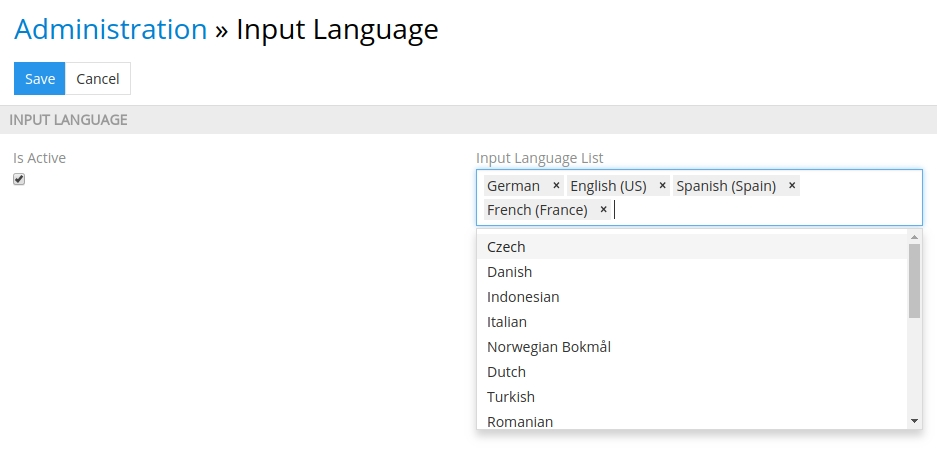
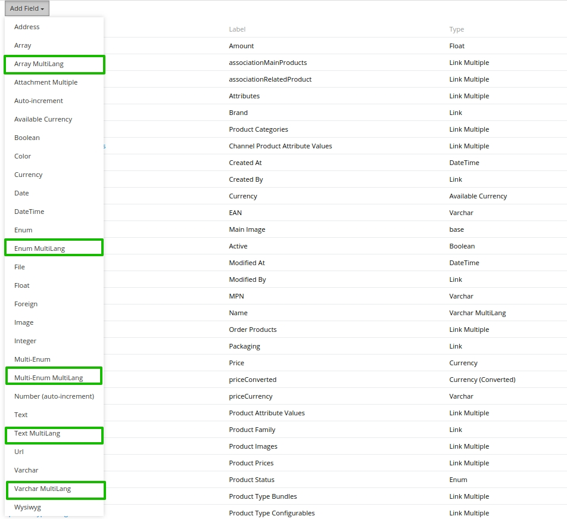
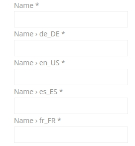
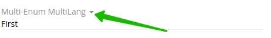
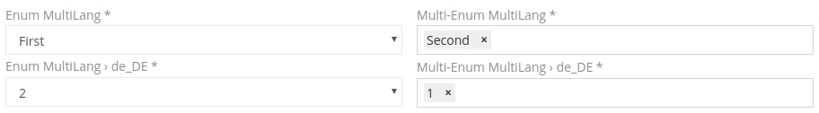
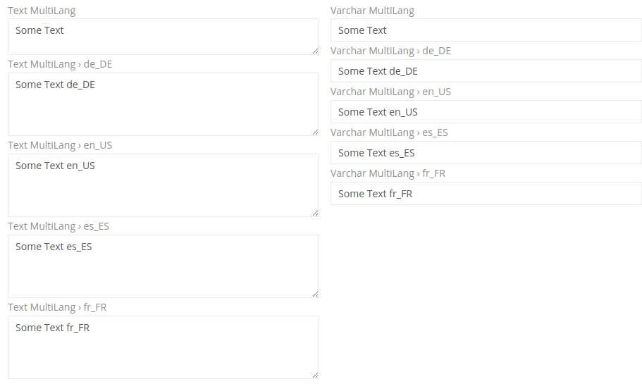
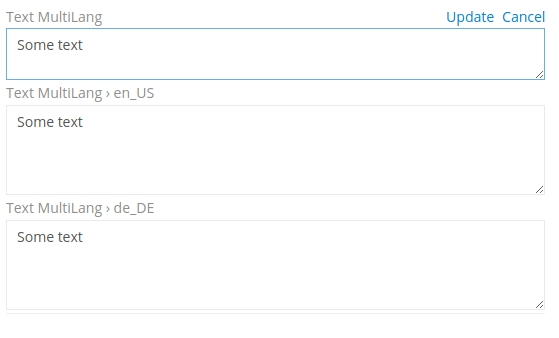
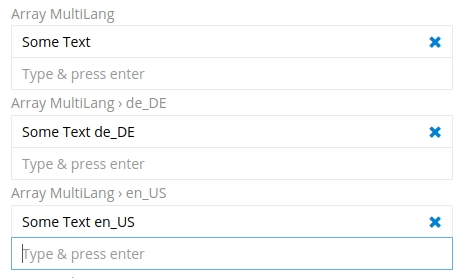

# TreoPIM Multi-Language and Local Fields

Modulversion 1.8.0 (von 19.10.2018) für TreoPIM 

### Meta Description

Das Modul ermöglicht es, mehrsprachige und lokale Feldwerte abzuspeichern. 

## Kurzbeschreibung

Dieses Modul ermöglicht es, Sprachen hinzuzufügen und mehrsprachige Felder der Typen "Varchar MultiLang", "Text MultiLang", "Enum MultiLang", "Multi-Enum MultiLang" oder  "Array MultiLang" für jede beliebige Entität im System zu erstellen. Die Verifikation der mehrsprachigen Feldwerte vereinfacht wesentlich die Produktverwaltung und die Produktbeschreibungen bleiben in Ihrem Onlineshop immer aktuell.

### Modulinstallation
- Das Modul wird mit dem System installiert und ist Teil des Systems.
- Eine Entfernung des Moduls ist nicht möglich. 

## Funktionen für den Administrator 

#### Modulaktivierung 

Um die Funktion für die Eingabe der mehrsprachigen Feldwerte zu aktivieren, gehen Sie in Administration > Input Language und setzen Sie das Häkchen bei "Is Active". Das Modul ist standardmäßig aktiviert.

Wenn Produktinformationen nur in einer Sprache eingegeben werden, muss die Option "Is Active" deaktiviert werden. Dabei bleibt das Standardfeld für die Werteingabe sichtbar? und die Felder für die Eingabe von Werten in anderen Sprachen werden deaktiviert. 

#### Änderung der Sprachenliste 
Um die Sprachen zu ändern, für die die mehrsprachigen Felder ausgefüllt werden müssen, ist es notwendig, die Mehrfachauswahl "Input Language List" zu nutzen. Hier ist möglich, sowohl neue Sprachen auszuwählen als auch schon früher eingegebene zu entfernen. 

  

Beim Hinzufügen einer zusätzlichen Sprache zu jedem mehrsprachigen Feld wird ein neues Eingabefeld (ohne Werte) angezeigt. 

Beim Ausschalten einer bestimmten Sprache wird das Eingabefeld und sein Wert aus dem Layout entfernt. **Aber wenn diese Sprache erneut eingeschaltet wird, werden die früher eingegebenen Werte wiederhergestellt.** 

#### Erstellung der mehrsprachigen Felder 
Um ein mehrsprachiges Feld zu erstellen, muss man die Entität im Entity Manager auswählen, auf "Add Field" klicken, den mehrsprachigen Feldtypen auswählen und alle notwendigen Metadaten für ihn angeben. Nachher muss man das neue Feld im Layout-Manager anzeigen lassen.     

Das Modul ermöglicht es, die folgenden mehrsprachigen Feldtypen zu erstellen:  

| Feldtyp              | Beschreibung                             |
| -------------------- | ---------------------------------------- |
| Varchar MultiLang    | Feldtyp für Abspeicherung kurzer mehrsprachiger Textwerte (bis zu 255 Zeichen) |
| Text MultiLang       | Feldtyp für Abspeicherung langer mehrsprachiger Textwerte |
| Enum MultiLang       | Feldtyp für Abspeicherung  mehrsprachiger Werte der Dropdown-Liste mit der Möglichkeit, nur einer der Varianten auszuwählen |
| Multi-Enum MultiLang | Feldtyp für Abspeicherung mehrsprachiger Werte der Dropdown-Liste  mit der Möglichkeit, eine oder mehrere Varianten auszuwählen |
| Array MultiLang      | Feldtyp für Abspeicherung mehrsprachiger Textwerte von einer dynamischen Datenmenge (der Benutzer kann einen Wert oder einige Werte bei der Feldbearbeitung manuell hinzufügen oder speichern) |

Wenn Ihr System schon mit einem externen System integriert ist und Sie ein mehrsprachiges Feld statt des einfachen Feldes (z.B. Produktname) hinzufügen, kann eine Änderung des Mappings für die korrekte Arbeit mit den externen Systemen erforderlich sein.  

Wenn das mehrsprachige Feld ein Pflichtfeld ist, ist die Eingabe der Werte für alle aktivierten Sprachen im System TreoPIM auch obligatorisch:  

Die Anzahl der Varianten zur Auswahl oder die Anzahl der eingegebenen Werte in den Feldern der Typen Enum MultiLang, Multi-Enum MultiLang und Array MultiLang muss in allen Sprachen gleich sein. Die sachliche Übereinstimmung der Feldwerte in verschiedenen Sprachen kann das System nicht überprüfen, deshalb muss diese vom Admin kontrolliert werden. Der erste Standardwert des Feldes "one" muss z.B. mit dem ersten Wert des deutschen Feldes "eins" übereinstimmen.     

## Funktionen für den Nutzer

Jedes mehrsprachige Feld hat einen Standardwert und zusätzliche Sprachfelder (ihre Anzahl ist gleich der Anzahl von Sprachen, die Sie aktiviert haben). Der Standardwert des mehrsprachigen Feldes wird an keine Sprache angebunden. 

Namen der mehrsprachigen Felder beinhalten die Bezeichnung der Sprache: "en_US", "de_DE" usw. 

Bei der Anzeige der Entität wird nur ein Standardwert angezeigt und die Werte der Sprachfelder sind ausgeblendet. 

Zur Anzeige der Sprachfelder muss man auf das Aufklappen-Icon klicken. 

Die möglichen Werte von Feldern der Typen Enum MultiLang und Multi-Enum MultiLang werden für jede Sprache vom Admin angegeben. Die Nutzer können bei der Bearbeitung nur aus den vorhandenen Werten auswählen. 

Für die Felder der Typen Varchar MultiLang und Text MultiLang werden die zusätzlichen Eingabefelder für alle Sprachen hinzugefügt, die bei den Moduleinstellungen aktiviert wurden und die von den Nutzern ausgefüllt werden. 

Beim Speichern werden die leeren mehrsprachigen Felder der Typen Varchar MultiLang und Text MultiLang mit den Werten aus dem Standardfeld ausgefüllt. Wenn Sie noch eine Sprache nach der Erstellung und dem Ausfüllen des mehrsprachigen Feldes hinzugefügt haben, bleibt sein Wert für eine neue Sprache leer. 

Die Werte des Feldes vom Typ Array MultiLang werden von den Nutzern (nicht vom Admin) bei der Bearbeitung des Eintrages in der Entität eingegeben. 

 