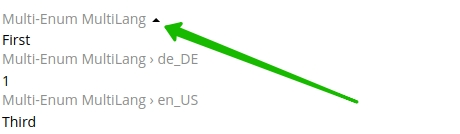

# TreoPIM Multi-Language and Locale Fields

Модуль, предоставляет возможность добавления дополнительных мультиязычных значений с указанием локализации  для атрибутов продукта, а также для любых полей любой другой сущности.

## Краткое описание

Данный модуль позволяет создавать и использовать мультиязычнные поля для введения текстовых значений для атрибутов родукта или любых других атрибутов любой сущности системы. Мультиязычность с указанием локализации задаеться с помощью соответствующего типа поля, в которое потом можно вводить значения в зависимости от языков, которые используются в системе.

## Установка модуля
- Модуль устанавливается вместе с системой и является её частью. 
- Удаление модуля невозможно.

## Функции для администратора
- Модуль TreoPIM Multi-Language and Locale Fields добавляет настройки языков ввода для всех мультиязычных полей, которые присутвуют в системе. 

- Для активации функции введения мультиязычных значений необходимо перейти в Администрировании в Input Language и активировать модуль (по умолчанию активирован), установив соответствующую отметку значения активности - Is Active. 

- Eсли информация о продуктах будет задаваться только на одном языке опцию "Is Active" нужно деактивировать, при этом дефолтное поле для введения значения останется, поля для введения значений на дополнительных языках будут деактивированы.

- Для изменения языков, для которых должны заполнятся мультиязычные поля необходимо  воспользоваться мультиселектом Input Language List, здесь можна как выбрыть новые, так и удалить уже заданные ранее языки.

  

- В случае добавления дополнительного языка в каждое из мультиязычных полей, будет добавлено дополнительное поле ввода - значения в данном поле будут отсутствовать. При отключении определенного языка - поле ввода, а также его значение будет убрано, но в случае повторного включения данного языка, введенные значения будут восстановлены.  

- Для создания мультиязычного поля в сущности необходимо перейти в Entity Manager в Администрировании, нажать кнопку "Add Field", выбрать мультиязычний тип поля, для поля, которое необходимо добавить и задать все-необходимые мета-данные.

- Модуль дает возможность создания следующих мультиязычных типов полей:

| Тип     | Описание                                                     |
| ------- | ------------------------------------------------------------ |
| Varchar MultiLang    | тип поля для хранения мультиязычных строчных значений        |
| Text MultiLang       | мультиязычный показатель, для ввода и определения текстовой информации |
| Enum MultiLang       | мультиязычный показатель, выпадающий список с возможность выбора только одно из вариантов |
| Multi-Enum MultiLang | мультиязычный показатель, выпадающий список с возможностью выбора нескольких вариантов |
| Array MultiLang      | мультиязычный показатель, для определения массива данных, который может динамически меняться пользователем и не является статичным |
  
  

- Указанные выше типы полей могут быть добавлены как поля для определенной сущности, так и как атрибут для продукта.

- В случае, если поле является обязательным для заполнения, обязательным является и задание соответвующих значений для всех активированных языков в системе TreoPIM:
  

## Функции для пользователя
- Для дефолтного значения атрибута значение локализации не задается.

- Каждое из мультиязычных полей имеет дополнительные поля для ввода значений в соответсвии с выбранными языками в настойках модуля.

- Внесение и валидация значений для мультиязычных полей просходит аналогично любым другим полям.

- При включенном модуле мультиязычности, в зависимости от настроек сущности, основные поля для ввода текста можно, заменить на мультиязычные, такие как: Name, Description и т.д. Для внесения подобных изменений свяжитесь с разработчиком или создайте соответствующий тип поля через Entity Manager, как дубль поля и вывести его с помощью Layout Manager

- При редактировании мультиязычного поля, будут отображены поля для ввода, языки которых были активированы в настройках модуля. В случае отсутвия значений в мультиязычных полях типа Varchar и Text MultiLang, значения в поля с локализацией будут скопированы из поля по умолчанию.
  

- При просмотре сущности мультиязычные поля скрыты, как список.

  

- При необходимости просмотра значений для всех языков  необходимо развернуть поле нажав на иконку разворота.
  

- Количество вариантов для выбора или заданых значений в полях типа Enum MultiLang, Multi-Enum MultiLang и Array MultiLang  на всех языках одинаковое.

- Для полей типа Varchar MultiLang и Text MultiLang добавляются дополнительные поля ввода на установленных языках.

- 
- Для полей типа Enum MultiLang и  Multi-Enum MultiLang значения для каждого из языков задаются при их создании и добавлении к сущности или добавлении как атрибута для продукта, которые, в дальнейшем, могут быть выбраны из выпадающего списка. 
    
- Для поля типа Array MultiLang значения задаются при редактировании поля в сущности или  атрибута продукта
    
- В названии поля присутвует обозначение языка поля и локализации для значений поля: en_US, de_DE и т.д.  